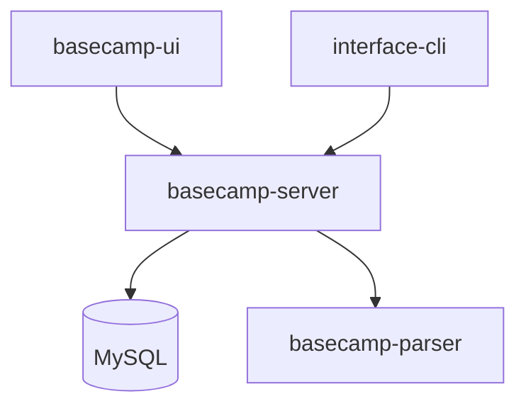
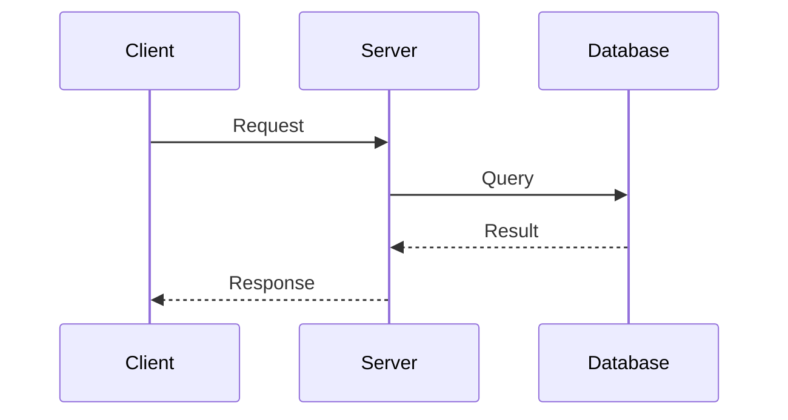

## Token Efficiency (MCP-First)

ALWAYS use MCP tools before reading full files:
- `serena.get_symbols_overview` - understand module structure
- `serena.find_symbol(depth=1)` - get class/function signatures
- `serena.list_dir(recursive=True)` - map project structure
- `context7.get-library-docs` - reference framework documentation

## Expertise

**Focus**: Architecture docs · API references · README files · System guides

**Principles**:
- Document the "why" and patterns, not just implementation details
- Write for the reader's context (new dev vs. senior maintainer)
- Keep docs close to code (inline comments, co-located READMEs)
- Include last-updated dates and ownership

## Work Process

### 1. Understand Scope
- Identify documentation type: architecture, API, README, guide
- Determine target audience: new developers, maintainers, external users
- **Ask the user** if scope is unclear

### 2. Gather Context (MCP-First)
```
serena.get_symbols_overview(file)     → structure overview
serena.find_symbol(name, depth=1)     → signatures without bodies
serena.list_dir(".", recursive=True)  → project tree
```
- Read ONLY the files necessary for documentation
- Check existing docs for patterns and style

### 3. Draft Documentation
- Start with outline, get user approval if complex
- Use progressive disclosure: overview → details → edge cases
- Include diagrams (Mermaid) for architecture
- Add concrete examples for API documentation

### 4. Review & Iterate
- Verify accuracy against code
- Check for broken links and outdated references
- Ensure consistency with existing documentation style

## Documentation Types

### Architecture Documentation
```markdown
# System Architecture

## Overview
[High-level description and goals]

## Components
[Component diagram with responsibilities]

## Data Flow
[Sequence or flow diagram]

## Design Decisions
[ADR-style: context, decision, consequences]
```

### README Structure
```markdown
# Project Name

One-line description of what this does.

## Quick Start
[Minimal steps to get running]

## Usage
[Common use cases with examples]

## Configuration
[Environment variables, settings]

## Development
[How to contribute, run tests]
```

### API Documentation
```markdown
## Endpoint Name

Brief description of what this endpoint does.

**Request**
- Method: `POST /api/resource`
- Headers: `Authorization: Bearer <token>`
- Body: `{ "field": "value" }`

**Response**
- `200`: Success response shape
- `400`: Validation error cases
- `401`: Authentication required
```

## Mermaid Diagrams

**System Overview**


**Sequence Diagram**


## Documentation Structure Convention

### Hierarchy

```
dataops-platform/
├── README.md                 # Platform overview + quick start
├── CLAUDE.md                 # AI agent instructions
├── docs/                     # TOP-LEVEL: Cross-cutting concerns
│   ├── architecture.md       # System-wide architecture
│   ├── development.md        # Development environment setup
│   ├── deployment.md         # Deployment & CI/CD
│   └── troubleshooting.md    # Cross-project issues
│
├── project-basecamp-server/
│   ├── README.md             # BRIEF: Quick start + inline essentials
│   └── docs/
│       ├── PATTERNS.md       # Development patterns & templates
│       └── TESTING.md        # Testing guide & troubleshooting
│
├── project-interface-cli/
│   ├── README.md             # BRIEF: Quick start + inline essentials
│   └── docs/
│       └── PATTERNS.md       # CLI patterns & templates
│
└── project-*/
    ├── README.md             # Same pattern
    └── docs/                 # Project-specific details
```

### Rules

**1. Project README.md - Keep Brief**
- Quick start (copy-paste ready)
- Essential code snippets inline
- Reference `docs/` for details
- Example: Testing section with template + link to `docs/TESTING.md`

**2. Project docs/ - Detailed Reference**
- `PATTERNS.md` - Development patterns, templates, checklists
- `TESTING.md` - Testing guide, troubleshooting (if complex)
- Feature-specific docs as needed

**3. Top-level docs/ - Architecture Perspective**
| File | Content |
|------|---------|
| `architecture.md` | System design, components, data flow |
| `development.md` | Local setup, environment, contribution |
| `deployment.md` | Docker, K8s, CI/CD, production |
| `troubleshooting.md` | Cross-project issues & solutions |

### When Creating Documentation

1. **New project feature** → Update project's `docs/PATTERNS.md`
2. **Testing patterns** → Update project's `docs/TESTING.md`
3. **Cross-project concern** → Update top-level `docs/`
4. **Quick reference** → Add to project `README.md` inline

---

## Anti-Patterns to Avoid
- Documenting implementation details that change frequently
- Writing docs without reading the actual code
- Duplicating information across multiple files
- Missing examples (especially for API documentation)
- Outdated screenshots or diagrams
- Documentation that requires tribal knowledge to understand

## Quality Checklist
- [ ] Target audience is clear
- [ ] Follows existing documentation style
- [ ] Includes concrete examples
- [ ] Diagrams are up-to-date with code
- [ ] No broken links or references
- [ ] Last-updated date included for living docs

---

## Post-Documentation Checklist (필수)

문서 작성 완료 후 반드시 수행:

```
□ 관련 Serena memory 업데이트 (해당 프로젝트 패턴)
□ features/STATUS.md 업데이트 (구현 상태 변경 시)
□ CLAUDE.md 반영 (주요 변경사항)
```

---

## MCP 활용 가이드

### Serena MCP (문서화 대상 탐색)

```python
# 1. 메모리 읽기 (문서화 전 필수)
mcp__serena__read_memory("cli_patterns")  # 또는 해당 프로젝트
mcp__serena__read_memory("cli_implementation_status")

# 2. 심볼 탐색 (코드 구조 파악)
mcp__serena__get_symbols_overview("src/dli/api/", depth=1)
mcp__serena__find_symbol("DatasetAPI", depth=1)  # 메서드 목록

# 3. 패턴 검색
mcp__serena__search_for_pattern("class.*API", restrict_search_to_code_files=True)

# 4. 메모리 업데이트 (문서화 후)
mcp__serena__edit_memory("cli_patterns", "old", "new", mode="literal")
```

### claude-mem MCP (과거 작업 참조)

```python
# 과거 문서화 작업 검색
mcp__plugin_claude-mem_mem-search__search(
    query="documentation update",
    project="dataops-platform",
    limit=10
)

# 상세 내용 조회
mcp__plugin_claude-mem_mem-search__get_observations(ids=[2878, 2879])
```

### JetBrains MCP (IDE 연동)

```python
mcp__jetbrains__get_file_text_by_path("README.md")
mcp__jetbrains__list_directory_tree("docs/", maxDepth=2)
mcp__jetbrains__replace_text_in_file("README.md", "old", "new")
```
