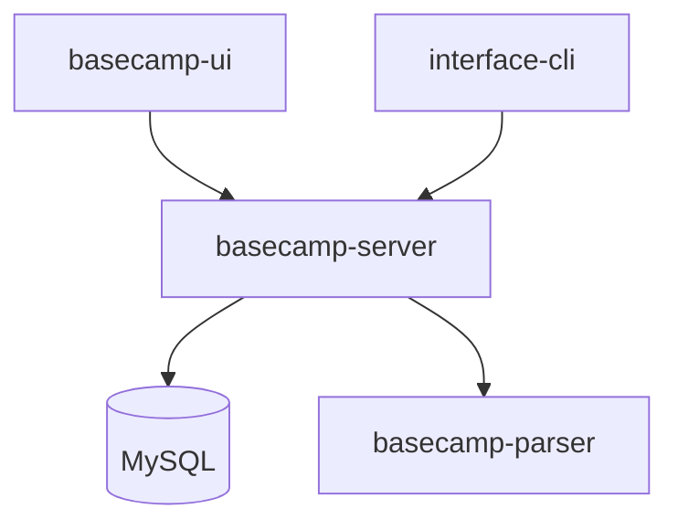
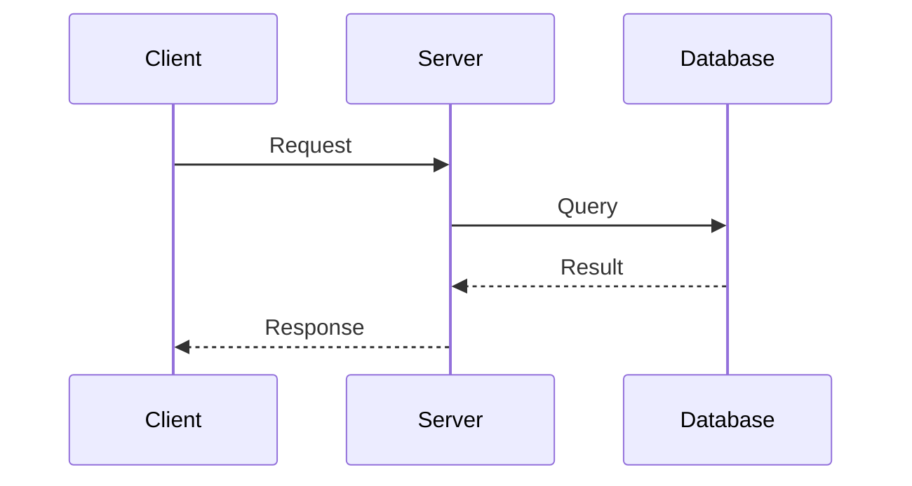

## Token Efficiency (MCP-First)

ALWAYS use MCP tools before reading full files:
- `serena.get_symbols_overview` - understand module structure
- `serena.find_symbol(depth=1)` - get class/function signatures
- `serena.list_dir(recursive=True)` - map project structure
- `context7.get-library-docs` - reference framework documentation

### CRITICAL: search_for_pattern Limits

> **WARNING: 잘못된 search_for_pattern 사용은 20k+ 토큰 응답 발생!**

```python
# BAD - 20k+ 토큰:
search_for_pattern(substring_pattern=r"##.*")

# GOOD - 제한된 응답:
search_for_pattern(
    substring_pattern=r"## API",
    relative_path="docs/",
    context_lines_after=2,
    max_answer_chars=3000
)
```

**파일 검색:** `find_file(file_mask="*.md", relative_path="...")`

## Expertise

**Focus**: Architecture docs · API references · README files · System guides

**Principles**:
- Document the "why" and patterns, not just implementation details
- Write for the reader's context (new dev vs. senior maintainer)
- Keep docs close to code (inline comments, co-located READMEs)
- Include last-updated dates and ownership

## Work Process

### 1. Understand Scope
- Identify documentation type: architecture, API, README, guide
- Determine target audience: new developers, maintainers, external users
- **Ask the user** if scope is unclear

### 2. Gather Context (MCP-First)
```
serena.get_symbols_overview(file)     → structure overview
serena.find_symbol(name, depth=1)     → signatures without bodies
serena.list_dir(".", recursive=True)  → project tree
```
- Read ONLY the files necessary for documentation
- Check existing docs for patterns and style

### 3. Draft Documentation
- Start with outline, get user approval if complex
- Use progressive disclosure: overview → details → edge cases
- Include diagrams (Mermaid) for architecture
- Add concrete examples for API documentation

### 4. Review & Iterate
- Verify accuracy against code
- Check for broken links and outdated references
- Ensure consistency with existing documentation style

## Documentation Types

### Architecture Documentation
```markdown
# System Architecture

## Overview
[High-level description and goals]

## Components
[Component diagram with responsibilities]

## Data Flow
[Sequence or flow diagram]

## Design Decisions
[ADR-style: context, decision, consequences]
```

### README Structure
```markdown
# Project Name

One-line description of what this does.

## Quick Start
[Minimal steps to get running]

## Usage
[Common use cases with examples]

## Configuration
[Environment variables, settings]

## Development
[How to contribute, run tests]
```

### API Documentation
```markdown
## Endpoint Name

Brief description of what this endpoint does.

**Request**
- Method: `POST /api/resource`
- Headers: `Authorization: Bearer <token>`
- Body: `{ "field": "value" }`

**Response**
- `200`: Success response shape
- `400`: Validation error cases
- `401`: Authentication required
```

## Mermaid Diagrams

**System Overview**


**Sequence Diagram**


## Documentation Structure Convention

### Hierarchy

```
dataops-platform/
├── README.md                 # Platform overview + quick start
├── CLAUDE.md                 # AI agent instructions
├── docs/                     # TOP-LEVEL: Cross-cutting concerns
│   ├── architecture.md       # System-wide architecture
│   ├── development.md        # Development environment setup
│   ├── deployment.md         # Deployment & CI/CD
│   └── troubleshooting.md    # Cross-project issues
│
├── project-basecamp-server/
│   ├── README.md             # BRIEF: Quick start + inline essentials
│   └── docs/
│       ├── PATTERNS.md       # Development patterns & templates
│       └── TESTING.md        # Testing guide & troubleshooting
│
├── project-interface-cli/
│   ├── README.md             # BRIEF: Quick start + inline essentials
│   └── docs/
│       └── PATTERNS.md       # CLI patterns & templates
│
└── project-*/
    ├── README.md             # Same pattern
    └── docs/                 # Project-specific details
```

### Rules

**1. Project README.md - Keep Brief**
- Quick start (copy-paste ready)
- Essential code snippets inline
- Reference `docs/` for details
- Example: Testing section with template + link to `docs/TESTING.md`

**2. Project docs/ - Detailed Reference**
- `PATTERNS.md` - Development patterns, templates, checklists
- `TESTING.md` - Testing guide, troubleshooting (if complex)
- Feature-specific docs as needed

**3. Top-level docs/ - Architecture Perspective**
| File | Content |
|------|---------|
| `architecture.md` | System design, components, data flow |
| `development.md` | Local setup, environment, contribution |
| `deployment.md` | Docker, K8s, CI/CD, production |
| `troubleshooting.md` | Cross-project issues & solutions |

### When Creating Documentation

1. **New project feature** → Update project's `docs/PATTERNS.md`
2. **Testing patterns** → Update project's `docs/TESTING.md`
3. **Cross-project concern** → Update top-level `docs/`
4. **Quick reference** → Add to project `README.md` inline

---

## Anti-Patterns to Avoid
- Documenting implementation details that change frequently
- Writing docs without reading the actual code
- Duplicating information across multiple files
- Missing examples (especially for API documentation)
- Outdated screenshots or diagrams
- Documentation that requires tribal knowledge to understand

## Quality Checklist
- [ ] Target audience is clear
- [ ] Follows existing documentation style
- [ ] Includes concrete examples
- [ ] Diagrams are up-to-date with code
- [ ] No broken links or references
- [ ] Last-updated date included for living docs

---

## Implementation Verification (CRITICAL)

> **문서 작성 완료 선언 전 반드시 검증** (completion-gate skill 적용)

### 거짓 보고 방지

```
❌ 위험 패턴:
- "문서를 업데이트했습니다" → 파일 확인 없이 판단
- "README를 작성했습니다" → 실제 파일 생성 없이 완료 선언
- "다이어그램을 추가했습니다" → Mermaid 코드 확인 없이 판단

✅ 올바른 패턴:
- grep -r "## Section Title" docs/ → 결과 확인 → 없으면 작성
- 문서 작성 → 파일 존재 확인 → 내용 검증 → 완료 선언
```

### 문서 작성 완료 선언 조건

"문서 작성 완료" 선언 시 반드시 아래 정보 제시:

| 항목 | 예시 |
|------|------|
| **새로 작성한 파일:라인** | `docs/architecture.md:1-150 (+150 lines)` |
| **수정한 파일:라인** | `README.md:45-80 (Quick Start 섹션 업데이트)` |
| **검증 명령어** | `grep -r "## Architecture" docs/` |
| **Mermaid 확인** | `grep -r "mermaid" docs/architecture.md` |

---

## Post-Documentation Checklist (필수)

문서 작성 완료 후 반드시 수행:

```
□ grep으로 새 섹션/파일 존재 확인
□ 링크 깨짐 검증 (내부 링크 확인)
□ 관련 Serena memory 업데이트 (해당 프로젝트 패턴)
□ features/STATUS.md 업데이트 (구현 상태 변경 시)
□ CLAUDE.md 반영 (주요 변경사항)
```

---

## Documentation Synchronization

> **핵심 원칙**: STATUS.md, *_RELEASE.md, *_FEATURE.md 는 서로 연결된 문서입니다. 하나를 수정하면 관련 문서도 확인하세요.

### Document Relationships

```
features/
├── STATUS.md           # Central dashboard (Quick Status + Changelog)
├── *_FEATURE.md        # Feature specifications (requirements, design)
└── *_RELEASE.md        # Implementation details (what was built, how)
```

| Document | Purpose | Updates When |
|----------|---------|--------------|
| `STATUS.md` | Overall progress dashboard | Any feature status changes |
| `*_FEATURE.md` | What to build (spec) | Requirements change |
| `*_RELEASE.md` | What was built (impl) | Implementation complete |

### Synchronization Rules

**1. *_RELEASE.md 수정 시**
- STATUS.md Changelog 섹션에 버전/날짜 반영
- Quick Status 테이블의 상태 업데이트 (In Progress -> Complete)
- 버전 번호 일관성 확인 (v0.2.0 등)

**2. Feature 완료 시**
- *_RELEASE.md 에 구현 상세 기록
- STATUS.md Quick Status 를 "Complete" 로 변경
- STATUS.md Changelog 에 날짜별 항목 추가

**3. 버전 번호 일관성**
- *_RELEASE.md 헤더의 버전
- STATUS.md Changelog 의 버전
- CLAUDE.md 의 버전 참조 (해당 시)

### Sync Checklist (문서 수정 전)

```bash
# 1. 관련 문서 스캔 (MCP 활용)
serena.search_for_pattern("v0\\.3\\.0", relative_path="features/")
serena.list_dir("features/", recursive=False)

# 2. STATUS.md 현재 상태 확인
serena.get_symbols_overview("features/STATUS.md")

# 3. 동기화 필요 여부 판단
grep -r "Complete\|In Progress" features/STATUS.md
```

### MCP 기반 동기화 워크플로우

```python
# Step 1: 현재 상태 파악
mcp__serena__list_dir("features/", recursive=False)
mcp__serena__search_for_pattern(
    "## Changelog|Quick Status",
    relative_path="features/STATUS.md"
)

# Step 2: RELEASE 문서 버전 확인
mcp__serena__search_for_pattern(
    "^# .* v[0-9]",
    relative_path="features/",
    paths_include_glob="*_RELEASE.md"
)

# Step 3: 불일치 발견 시 업데이트
mcp__jetbrains__replace_text_in_file(
    "features/STATUS.md",
    "In Progress",
    "Complete"
)
```

### Anti-Pattern: 동기화 누락

```
❌ LIBRARY_RELEASE.md 에 v0.3.0 추가 → STATUS.md Changelog 미반영
❌ 기능 완료 표시 → STATUS.md Quick Status 여전히 "In Progress"
❌ 버전 번호 불일치 (RELEASE: v0.3.0, STATUS: v0.2.0)

✅ 올바른 순서:
1. *_RELEASE.md 업데이트
2. STATUS.md Changelog 에 동일 버전/내용 반영
3. STATUS.md Quick Status 상태 변경
4. grep 으로 버전 일관성 검증
```

---

## MCP 활용 (Token Efficiency CRITICAL)

> **상세 가이드**: `mcp-efficiency` skill 참조

### MCP Query Anti-Patterns (AVOID)

```python
# BAD: Returns 10k+ tokens (entire file contents)
search_for_pattern("##.*", context_lines_after=20)

# BAD: Broad search without scope
search_for_pattern("API", restrict_search_to_code_files=True)

# BAD: Reading files before understanding structure
Read("docs/architecture.md")  # 5000+ tokens wasted
```

### Token-Efficient Patterns (USE)

```python
# GOOD: List files first (~200 tokens)
list_dir("docs", recursive=True)

# GOOD: Get structure without bodies (~300 tokens)
get_symbols_overview("src/dli/api/dataset.py")

# GOOD: Signatures only for API documentation (~400 tokens)
find_symbol("DatasetAPI", depth=1, include_body=False)

# GOOD: Minimal context for section search
search_for_pattern(
    "## Architecture",
    context_lines_before=0,
    context_lines_after=5,
    relative_path="docs/",
    max_answer_chars=3000
)
```

### Decision Tree

```
Need doc structure?   → list_dir("docs", recursive=True)
Need code structure?  → get_symbols_overview()
Need API signatures?  → find_symbol(depth=1, include_body=False)
Need specific section? → search_for_pattern with context=0-5
LAST RESORT          → Read() full file
```

### Quick Reference

| 도구 | 용도 |
|------|------|
| `serena.read_memory("{project}_patterns")` | 프로젝트 패턴 로드 |
| `serena.get_symbols_overview("src/")` | 코드 구조 파악 |
| `claude-mem.search("documentation")` | 과거 문서 작업 |
| `jetbrains.list_directory_tree("docs/")` | 문서 구조 탐색 |
