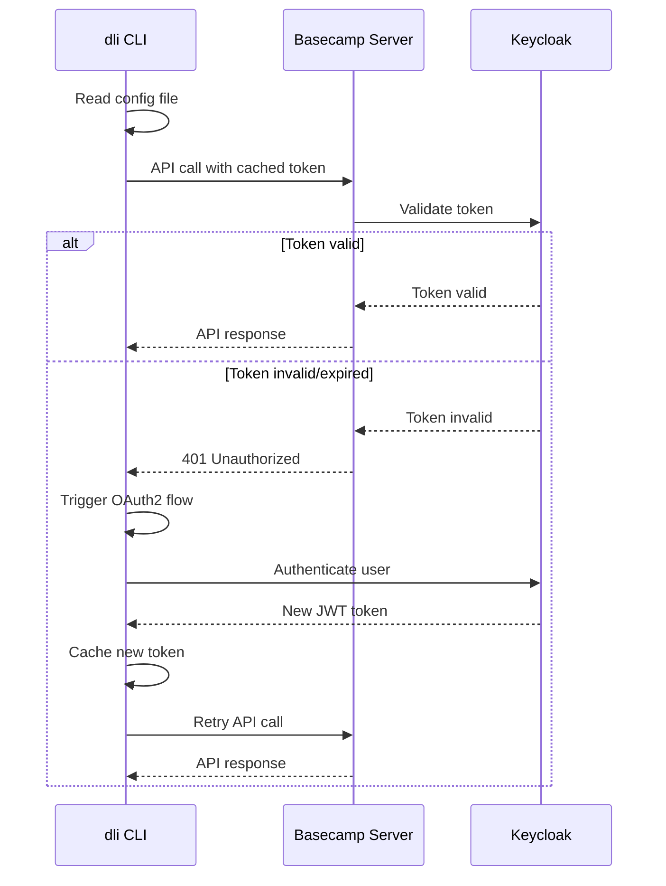

# CLI to API Mapping Reference

> **Target Audience:** Developers implementing server endpoints and CLI integration testing
> **Purpose:** Complete mapping between CLI commands and API endpoints
> **Cross-Reference:** [`ERROR_CODES.md`](../features/ERROR_CODES.md) for error code mapping

---

## 📋 Table of Contents

1. [Complete Command Mapping](#1-complete-command-mapping)
2. [Parameter Mapping](#2-parameter-mapping)
3. [Response Mapping](#3-response-mapping)
4. [Error Code Mapping](#4-error-code-mapping)
5. [Authentication Mapping](#5-authentication-mapping)
6. [CLI Integration Testing](#6-cli-integration-testing)

---

## 1. Complete Command Mapping

### 1.1 P0 Critical Commands (Implementation Priority 1)

| CLI Command | HTTP Method | API Endpoint | Implementation Status |
|-------------|-------------|--------------|----------------------|
| `dli metric list` | GET | `/api/v1/metrics` | ✅ P0 Week 1 |
| `dli metric get <name>` | GET | `/api/v1/metrics/{name}` | ✅ P0 Week 1 |
| `dli metric register <file>` | POST | `/api/v1/metrics` | ✅ P0 Week 1 |
| `dli metric run <name>` | POST | `/api/v1/metrics/{name}/run` | ✅ P0 Week 2 |
| `dli dataset list` | GET | `/api/v1/datasets` | ✅ P0 Week 2 |
| `dli dataset get <name>` | GET | `/api/v1/datasets/{name}` | ✅ P0 Week 2 |
| `dli dataset register <file>` | POST | `/api/v1/datasets` | ✅ P0 Week 2 |
| `dli dataset run <name>` | POST | `/api/v1/datasets/{name}/run` | ✅ P0 Week 2 |
| `dli debug` | GET | `/api/v1/health/extended` | ✅ P0 Week 2.5 |

**Total: 9 endpoints enabling core CLI functionality**

### 1.2 P1 High Priority Commands (Implementation Priority 2)

| CLI Command | HTTP Method | API Endpoint | Implementation Status |
|-------------|-------------|--------------|----------------------|
| `dli catalog list` | GET | `/api/v1/catalog/tables` | ✅ P1 Week 3-4 |
| `dli catalog search <keyword>` | GET | `/api/v1/catalog/search` | ✅ P1 Week 3-4 |
| `dli catalog get <table>` | GET | `/api/v1/catalog/tables/{table_ref}` | ✅ P1 Week 3-4 |
| `dli catalog queries <table>` | GET | `/api/v1/catalog/tables/{table_ref}/queries` | ✅ P1 Week 3-4 |
| `dli lineage show <name>` | GET | `/api/v1/lineage/{resource_name}` | ✅ P1 Week 5 |
| `dli lineage upstream <name>` | GET | `/api/v1/lineage/{resource_name}?direction=upstream` | ✅ P1 Week 5 |
| `dli lineage downstream <name>` | GET | `/api/v1/lineage/{resource_name}?direction=downstream` | ✅ P1 Week 5 |

**Total: 7 endpoints (4 unique) enabling data discovery**

### 1.3 P2 Medium Priority Commands (Implementation Priority 3)

| CLI Command | HTTP Method | API Endpoint | Implementation Status |
|-------------|-------------|--------------|----------------------|
| `dli workflow list` | GET | `/api/v1/workflows` | ✅ P2 Week 6-7 |
| `dli workflow run <name>` | POST | `/api/v1/workflows/{dataset_name}/run` | ✅ P2 Week 8-9 |
| `dli workflow backfill <name>` | POST | `/api/v1/workflows/{dataset_name}/backfill` | ✅ P2 Week 8-9 |
| `dli workflow stop <run_id>` | POST | `/api/v1/workflows/runs/{run_id}/stop` | ✅ P2 Week 8-9 |
| `dli workflow status <run_id>` | GET | `/api/v1/workflows/runs/{run_id}` | ✅ P2 Week 6-7 |
| `dli workflow history` | GET | `/api/v1/workflows/history` | ✅ P2 Week 6-7 |
| `dli workflow pause <name>` | POST | `/api/v1/workflows/{dataset_name}/pause` | ✅ P2 Week 6-7 |
| `dli workflow unpause <name>` | POST | `/api/v1/workflows/{dataset_name}/unpause` | ✅ P2 Week 6-7 |
| `dli workflow register <file>` | POST | `/api/v1/workflows/register` | ✅ P2 Week 8-9 |
| `dli workflow unregister <name>` | DELETE | `/api/v1/workflows/{dataset_name}` | ✅ P2 Week 8-9 |

**Total: 10 endpoints enabling workflow orchestration**

### 1.4 P3 Low Priority Commands (Implementation Priority 4)

| CLI Command | HTTP Method | API Endpoint | Implementation Status |
|-------------|-------------|--------------|----------------------|
| `dli quality list` | GET | `/api/v1/quality` | ✅ P3 Week 10 |
| `dli quality get <name>` | GET | `/api/v1/quality/{name}` | ✅ P3 Week 10 |
| `dli quality run <name>` | POST | `/api/v1/quality/test/{resource_name}` | ✅ P3 Week 10 |
| `dli query list` | GET | `/api/v1/catalog/queries` | ✅ P3 Week 10 |
| `dli query show <id>` | GET | `/api/v1/catalog/queries/{query_id}` | ✅ P3 Week 10 |
| `dli query cancel <id>` | POST | `/api/v1/catalog/queries/{query_id}/cancel` | ✅ P3 Week 10 |
| `dli transpile rules` | GET | `/api/v1/transpile/rules` | ✅ P3 Week 11-12 |
| `dli transpile metric <name>` | GET | `/api/v1/transpile/metrics/{metric_name}` | ✅ P3 Week 11-12 |
| `dli run <file>` | POST | `/api/v1/run/execute` | ✅ P3 Week 11-12 |
| `dli run policy` | GET | `/api/v1/run/policy` | ✅ P3 Week 11-12 |

**Total: 10 endpoints enabling advanced features**

### 1.5 Summary

| Priority | CLI Commands | Unique Endpoints | Implementation Timeline |
|----------|-------------|------------------|----------------------|
| **P0 Critical** | 9 commands | 9 endpoints | Week 1-2.5 |
| **P1 High** | 7 commands | 5 endpoints | Week 3-5 |
| **P2 Medium** | 10 commands | 9 endpoints | Week 6-9 |
| **P3 Low** | 10 commands | 10 endpoints | Week 10-12.5 |
| **TOTAL** | **36 commands** | **33 endpoints** | **12.5 weeks** |

---

## 2. Parameter Mapping

### 2.1 Common CLI Parameters to API Query Parameters

| CLI Flag | API Parameter | Type | Description | Example |
|----------|---------------|------|-------------|---------|
| `--tag <tag>` | `tag` | string | Filter by tag | `?tag=critical` |
| `--owner <email>` | `owner` | string | Filter by owner | `?owner=data@example.com` |
| `--search <term>` | `search` | string | Search in name/description | `?search=user` |
| `--limit <n>` | `limit` | int | Max results | `?limit=100` |
| `--offset <n>` | `offset` | int | Pagination offset | `?offset=50` |
| `--dry-run` | Request body | bool | Dry run execution | `{"dry_run": true}` |
| `--timeout <sec>` | Request body | int | Timeout seconds | `{"timeout": 300}` |

### 2.2 Metric/Dataset Specific Parameters

| CLI Flag | API Parameter | Type | Description |
|----------|---------------|------|-------------|
| `--parameters key=value` | Request body `parameters` | object | Execution parameters |
| `--format <format>` | Request body `download_format` | string | Result format (csv/parquet) |

### 2.3 Workflow Specific Parameters

| CLI Flag | API Parameter | Type | Description |
|----------|---------------|------|-------------|
| `--start-date <date>` | Request body `start_date` | string | Backfill start date |
| `--end-date <date>` | Request body `end_date` | string | Backfill end date |
| `--parallel` | Request body `parallel` | bool | Parallel backfill execution |

### 2.4 Catalog Specific Parameters

| CLI Flag | API Parameter | Type | Description |
|----------|---------------|------|-------------|
| `--project <project>` | `project` | string | Filter by project/catalog |
| `--dataset <dataset>` | `dataset` | string | Filter by dataset/schema |
| `--include-sample` | `include_sample` | bool | Include sample data |

### 2.5 Lineage Specific Parameters

| CLI Flag | API Parameter | Type | Description |
|----------|---------------|------|-------------|
| `--direction <dir>` | `direction` | string | upstream/downstream/both |
| `--depth <n>` | `depth` | int | Traversal depth (-1 = unlimited) |

---

## 3. Response Mapping

### 3.1 CLI Output Format vs API Response

**CLI Table Output (dli metric list):**
```
NAME                          OWNER              TAGS           UPDATED
iceberg.reporting.user_summary analyst@example.com reporting,daily 2025-12-15 14:30:00
```

**API Response:**
```json
[
  {
    "name": "iceberg.reporting.user_summary",
    "type": "Metric",
    "owner": "analyst@example.com",
    "tags": ["reporting", "daily"],
    "updated_at": "2025-12-15T14:30:00Z"
  }
]
```

### 3.2 CLI Detail Output vs API Response

**CLI Detail Output (dli metric get):**
```yaml
name: iceberg.reporting.user_summary
type: Metric
owner: analyst@example.com
team: "@analytics"
description: "User summary metrics"
sql: SELECT user_id, COUNT(*) FROM events GROUP BY 1
dependencies:
  - iceberg.raw.events
  - iceberg.dim.users
```

**API Response:**
```json
{
  "name": "iceberg.reporting.user_summary",
  "type": "Metric",
  "owner": "analyst@example.com",
  "team": "@analytics",
  "description": "User summary metrics",
  "sql": "SELECT user_id, COUNT(*) FROM events GROUP BY 1",
  "dependencies": ["iceberg.raw.events", "iceberg.dim.users"]
}
```

### 3.3 CLI Execution Result vs API Response

**CLI Execution Output (dli metric run):**
```
✓ Executed iceberg.reporting.user_summary in 1.2 seconds

   user_id  │ count
  ──────────┼────────
   user_001 │   150
   user_002 │   120

  Rows: 2, Duration: 1.2s
```

**API Response:**
```json
{
  "rows": [
    {"user_id": "user_001", "count": 150},
    {"user_id": "user_002", "count": 120}
  ],
  "row_count": 2,
  "duration_seconds": 1.2,
  "rendered_sql": "SELECT user_id, COUNT(*) FROM events WHERE date = '2026-01-01' GROUP BY 1"
}
```

---

## 4. Error Code Mapping

### 4.1 Server Error to CLI Error Code Translation

| Server Error Code | CLI Error Code | CLI Exit Code | CLI Display |
|-------------------|----------------|---------------|-------------|
| `METRIC_NOT_FOUND` | DLI-201 | 1 | `Error (DLI-201): Metric not found` |
| `METRIC_ALREADY_EXISTS` | DLI-202 | 1 | `Error (DLI-202): Metric already exists` |
| `METRIC_EXECUTION_TIMEOUT` | DLI-203 | 1 | `Error (DLI-203): Metric execution timed out` |
| `DATASET_NOT_FOUND` | DLI-301 | 1 | `Error (DLI-301): Dataset not found` |
| `WORKFLOW_NOT_FOUND` | DLI-401 | 1 | `Error (DLI-401): Workflow not found` |
| `VALIDATION_ERROR` | DLI-001 | 1 | `Error (DLI-001): Validation failed` |
| `UNAUTHORIZED` | DLI-002 | 1 | `Error (DLI-002): Authentication required` |
| `INTERNAL_ERROR` | DLI-999 | 2 | `Error (DLI-999): Internal server error` |

### 4.2 CLI Error Handling Examples

**Server Response (404):**
```json
{
  "error": {
    "code": "METRIC_NOT_FOUND",
    "message": "Metric 'iceberg.invalid.metric' not found",
    "details": {
      "metric_name": "iceberg.invalid.metric"
    }
  }
}
```

**CLI Display:**
```bash
$ dli metric get iceberg.invalid.metric --server-url http://localhost:8081

Error (DLI-201): Metric not found
└─ Metric 'iceberg.invalid.metric' not found

Suggestion: Check available metrics with 'dli metric list'

$ echo $?
1
```

---

## 5. Authentication Mapping

### 5.1 CLI Authentication to API Headers

| CLI Authentication Method | API Header | Example |
|---------------------------|------------|---------|
| `--api-key <key>` | `X-API-Key: <key>` | Service-to-service |
| OAuth2 flow (interactive) | `Authorization: Bearer <jwt>` | User authentication |
| Config file token | `Authorization: Bearer <jwt>` | Cached authentication |

### 5.2 CLI Configuration to API Calls

**CLI Config (dli.yaml):**
```yaml
server:
  url: http://localhost:8081
  auth:
    type: oauth2
    token: <cached-jwt-token>
```

**Generated API Call:**
```http
GET /api/v1/metrics HTTP/1.1
Host: localhost:8081
Authorization: Bearer <cached-jwt-token>
Accept: application/json
User-Agent: dli/0.9.1
```

### 5.3 Authentication Flow Integration



---

## 6. CLI Integration Testing

### 6.1 Test Coverage Matrix

| CLI Command Category | Test Cases | Server Endpoints Tested |
|---------------------|------------|------------------------|
| **Metric Operations** | 12 test cases | 4 endpoints |
| **Dataset Operations** | 12 test cases | 4 endpoints |
| **Catalog Operations** | 8 test cases | 4 endpoints |
| **Lineage Operations** | 6 test cases | 1 endpoint (3 variations) |
| **Workflow Operations** | 20 test cases | 9 endpoints |
| **Quality Operations** | 9 test cases | 3 endpoints |
| **Query Operations** | 9 test cases | 3 endpoints |
| **Run Operations** | 6 test cases | 2 endpoints |
| **Debug Operations** | 3 test cases | 1 endpoint |

**Total: 85 integration test cases covering 31 unique endpoints**

### 6.2 Integration Test Examples

**Test: Metric CRUD Operations**
```bash
#!/bin/bash
set -e

SERVER_URL="http://localhost:8081"
METRIC_NAME="test.integration.metric"

# Test 1: List metrics (should be empty initially)
echo "Testing metric list..."
dli metric list --server-url $SERVER_URL --limit 10

# Test 2: Get non-existent metric (should fail)
echo "Testing metric get (not found)..."
if dli metric get $METRIC_NAME --server-url $SERVER_URL; then
    echo "ERROR: Expected metric not found"
    exit 1
fi

# Test 3: Register new metric
echo "Testing metric register..."
cat > test_metric.yaml <<EOF
name: $METRIC_NAME
owner: test@example.com
description: "Integration test metric"
sql: "SELECT 1 as test_value"
tags: ["test", "integration"]
EOF

dli metric register test_metric.yaml --server-url $SERVER_URL

# Test 4: Get registered metric (should succeed)
echo "Testing metric get (found)..."
dli metric get $METRIC_NAME --server-url $SERVER_URL

# Test 5: Run metric
echo "Testing metric run..."
dli metric run $METRIC_NAME --server-url $SERVER_URL

# Test 6: List metrics (should include our metric)
echo "Testing metric list (with results)..."
RESULT=$(dli metric list --server-url $SERVER_URL --search integration)
if [[ ! "$RESULT" == *"$METRIC_NAME"* ]]; then
    echo "ERROR: Metric not found in list"
    exit 1
fi

echo "✓ All metric tests passed"
```

**Test: Error Handling**
```bash
#!/bin/bash

# Test authentication error
echo "Testing authentication error..."
if dli metric list --server-url http://localhost:8081 --api-key invalid; then
    echo "ERROR: Expected authentication failure"
    exit 1
fi

# Test validation error
echo "Testing validation error..."
cat > invalid_metric.yaml <<EOF
name: invalid-name-format
owner: not-an-email
sql: ""
EOF

if dli metric register invalid_metric.yaml --server-url http://localhost:8081; then
    echo "ERROR: Expected validation failure"
    exit 1
fi

echo "✓ Error handling tests passed"
```

### 6.3 Performance Test Requirements

| Operation | Performance Target | Test Method |
|-----------|-------------------|-------------|
| `dli metric list` | < 500ms | Load 1000 metrics, measure response time |
| `dli catalog list` | < 2000ms | Query 1000+ tables, measure response time |
| `dli metric run` | < 30s | Execute complex metric, measure timeout handling |
| `dli workflow run` | < 5s (trigger) | Trigger workflow, measure async response |

### 6.4 Continuous Integration Tests

**GitHub Actions Workflow:**
```yaml
name: CLI Integration Tests
on: [push, pull_request]

jobs:
  integration-test:
    runs-on: ubuntu-latest
    services:
      mysql:
        image: mysql:8.0
        env:
          MYSQL_ROOT_PASSWORD: password
        options: --health-cmd="mysqladmin ping" --health-interval=10s

      redis:
        image: redis:7-alpine
        options: --health-cmd="redis-cli ping" --health-interval=10s

    steps:
    - uses: actions/checkout@v3

    - name: Set up JDK 21
      uses: actions/setup-java@v3
      with:
        java-version: '21'
        distribution: 'temurin'

    - name: Start Basecamp Server
      run: |
        cd project-basecamp-server
        ./gradlew bootRun &
        sleep 30

    - name: Install CLI
      run: |
        cd project-interface-cli
        uv install
        uv pip install -e .

    - name: Run Integration Tests
      run: |
        chmod +x tests/integration/run_tests.sh
        ./tests/integration/run_tests.sh

    - name: Cleanup
      run: |
        pkill -f java || true
```

---

## 🔗 Related Documentation

- **Error Code Details**: [`ERROR_CODES.md`](../features/ERROR_CODES.md)
- **API Specifications**: [`METRIC_FEATURE.md`](../features/METRIC_FEATURE.md), [`DATASET_FEATURE.md`](../features/DATASET_FEATURE.md)
- **Implementation Plan**: [`IMPLEMENTATION_PLAN.md`](../features/IMPLEMENTATION_PLAN.md)
- **Integration Patterns**: [`INTEGRATION_PATTERNS.md`](../features/INTEGRATION_PATTERNS.md)

---

*This document provides the complete mapping between CLI commands and API endpoints, enabling seamless integration testing and validation of server implementations.*