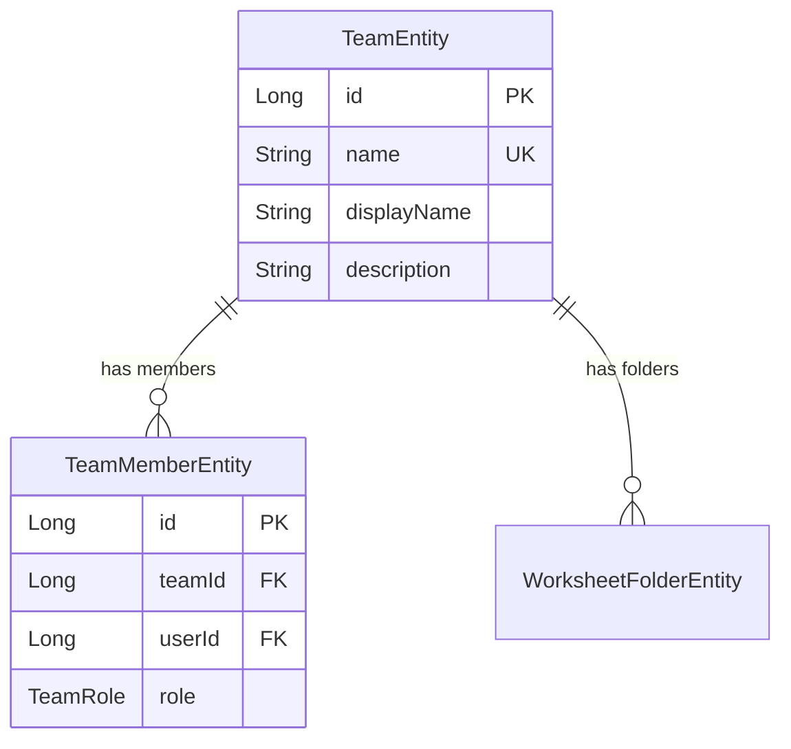
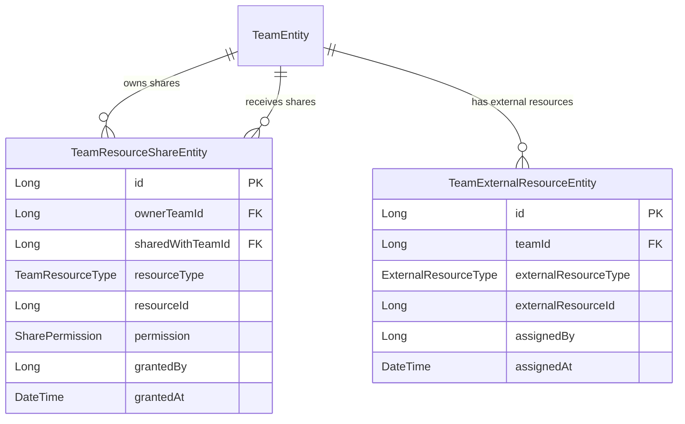

# Entity Relationships

> Entity relationships are managed through FK fields only, NOT JPA annotations (`@OneToMany`, `@ManyToOne`).
> Complex queries with joins are handled via QueryDSL.

**See Also:**
- [PATTERNS.md](./PATTERNS.md) - Quick reference patterns, entity relationship rules
- [IMPLEMENTATION_GUIDE.md](./IMPLEMENTATION_GUIDE.md) - Detailed entity patterns and QueryDSL examples

---

## Table of Contents

1. [Overview](#overview)
2. [Relationship Diagram](#relationship-diagram)
3. [Entity FK Reference](#entity-fk-reference)
4. [Domain Groups](#domain-groups)
5. [QueryDSL Join Patterns](#querydsl-join-patterns)

---

## Overview

### Why FK Fields Instead of JPA Relationships?

| Approach | JPA Relationships | FK Fields (Our Approach) |
|----------|-------------------|--------------------------|
| N+1 Queries | Lazy loading causes unpredictable query counts | Explicit QueryDSL fetches |
| Complexity | Cascade, orphan removal, bidirectional sync | Simple `Long`/`String` fields |
| Testing | Complex mock setup for relationships | Test entities in isolation |
| Boundaries | Entity controls related data | Service controls aggregation |

### Entity Base Classes

| Base Class | Features | Used By |
|------------|----------|---------|
| `BaseEntity` | Auto ID, audit fields (createdBy, updatedBy, createdAt, updatedAt), soft delete | Most entities |
| `BaseAuditableEntity` | Audit fields only (no auto ID) | Entities with natural keys (WorkflowEntity) |
| None (custom ID) | Custom ID strategy | CatalogTableEntity, CatalogColumnEntity, DatasetEntity, SampleQueryEntity |

---

## Relationship Diagram

```mermaid
erDiagram
    %% User Domain
    UserEntity ||--o{ UserAuthorityEntity : "has authorities"
    UserEntity ||--o{ ResourceEntity : "owns resources"
    UserEntity ||--o{ AuditAccessEntity : "access history"
    UserEntity ||--o{ AuditResourceEntity : "resource changes"

    %% Catalog Domain
    CatalogTableEntity ||--o{ CatalogColumnEntity : "has columns"
    CatalogTableEntity ||--o{ SampleQueryEntity : "has sample queries"

    %% Workflow Domain
    WorkflowEntity ||--o{ WorkflowRunEntity : "has runs"

    %% Airflow Domain
    AirflowClusterEntity ||--o{ WorkflowRunEntity : "cluster for runs"

    %% Quality Domain
    QualitySpecEntity ||--o{ QualityTestEntity : "contains tests"
    QualitySpecEntity ||--o{ QualityRunEntity : "has runs"
    QualityRunEntity ||--o{ TestResultEntity : "has results"
    QualityTestEntity ||--o| TestResultEntity : "produces results"

    %% Flag Domain
    FlagEntity ||--o{ FlagTargetEntity : "has targets"

    %% Resource Sharing Domain
    TeamEntity ||--o{ TeamResourceShareEntity : "owns shares"
    TeamEntity ||--o{ TeamResourceShareEntity : "receives shares"
    TeamResourceShareEntity ||--o{ UserResourceGrantEntity : "has grants"
    UserEntity ||--o{ UserResourceGrantEntity : "receives grants"

    %% Entity Definitions
    UserEntity {
        Long id PK
        String username
        String email
        UserRole role
    }

    UserAuthorityEntity {
        Long id PK
        Long userId FK
        String authority
    }

    ResourceEntity {
        Long id PK
        Long userId FK
        String resource
    }

    AuditAccessEntity {
        Long id PK
        Long userId FK
        String accessType
        String action
    }

    AuditResourceEntity {
        Long id PK
        Long userId FK
        Long resourceId
        String resourceType
        String action
    }

    CatalogTableEntity {
        Long id PK
        String name UK
        String project
        String datasetName
        String tableName
        String engine
        String owner
    }

    CatalogColumnEntity {
        Long id PK
        Long catalogTableId FK
        String name
        String dataType
        Int ordinalPosition
    }

    SampleQueryEntity {
        Long id PK
        String tableRef FK
        String title
        String sql
        String author
    }

    WorkflowEntity {
        String datasetName PK
        WorkflowSourceType sourceType
        WorkflowStatus status
        String owner
        String airflowDagId
    }

    WorkflowRunEntity {
        Long id PK
        String workflowId FK
        String runId UK
        String datasetName
        WorkflowRunStatus status
        Long airflowClusterId FK_nullable
    }

    AirflowClusterEntity {
        Long id PK
        String team UK
        String clusterName
        String airflowUrl
        AirflowEnvironment environment
        String dagS3Path
        String apiKey
        Boolean isActive
    }

    QualitySpecEntity {
        Long id PK
        String name UK
        String resourceName
        ResourceType resourceType
        String owner
    }

    QualityTestEntity {
        Long id PK
        Long specId FK
        String name
        TestType testType
        Severity severity
    }

    QualityRunEntity {
        Long id PK
        Long specId FK
        String runId UK
        String resourceName
        RunStatus status
    }

    TestResultEntity {
        Long id PK
        Long runId FK
        Long testId FK_nullable
        String testName
        TestStatus status
    }

    DatasetEntity {
        String id PK
        String name UK
        String owner
        String sql
    }

    MetricEntity {
        Long id PK
        String name UK
        String owner
        String sql
    }

    FlagEntity {
        Long id PK
        String flagKey UK
        String name
        String description
        FlagStatus status
        TargetingType targetingType
    }

    FlagTargetEntity {
        Long id PK
        Long flagId FK
        SubjectType subjectType
        Long subjectId
        Boolean enabled
        String permissions
    }

    TeamResourceShareEntity {
        Long id PK
        Long ownerTeamId FK
        Long sharedWithTeamId FK
        ShareableResourceType resourceType
        Long resourceId
        ResourcePermission permission
        Boolean visibleToTeam
        Long grantedBy FK
        DateTime grantedAt
    }

    UserResourceGrantEntity {
        Long id PK
        Long shareId FK
        Long userId FK
        ResourcePermission permission
        Long grantedBy FK
        DateTime grantedAt
    }
```

---

## Entity FK Reference

### User Domain

| Entity | FK Field | References | Cardinality | Notes |
|--------|----------|------------|-------------|-------|
| `UserAuthorityEntity` | `userId` | `UserEntity` | N:1 | Additional user authorities |
| `ResourceEntity` | `userId` | `UserEntity` | N:1 | User-owned resources |
| `AuditAccessEntity` | `userId` | `UserEntity` | N:1 | Access audit trail |
| `AuditResourceEntity` | `userId` | `UserEntity` | N:1 | Resource change audit |


### Catalog Domain

| Entity | FK Field | References | Cardinality | Notes |
|--------|----------|------------|-------------|-------|
| `CatalogColumnEntity` | `catalogTableId` | `CatalogTableEntity` | N:1 | Columns belong to a table |
| `SampleQueryEntity` | `tableRef` | `CatalogTableEntity.name` | N:1 | String FK (fully qualified name) |

### Workflow Domain

| Entity | FK Field | References | Cardinality | Notes |
|--------|----------|------------|-------------|-------|
| `WorkflowRunEntity` | `workflowId` | `WorkflowEntity.datasetName` | N:1 | String FK (dataset name as PK) |

### Airflow Domain

| Entity | FK Field | References | Cardinality | Notes |
|--------|----------|------------|-------------|-------|
| `WorkflowRunEntity` | `airflowClusterId` | `AirflowClusterEntity` | N:1 (nullable) | Optional cluster reference for sync |

### Quality Domain

| Entity | FK Field | References | Cardinality | Notes |
|--------|----------|------------|-------------|-------|
| `QualityTestEntity` | `specId` | `QualitySpecEntity` | N:1 | Tests belong to a spec |
| `QualityRunEntity` | `specId` | `QualitySpecEntity` | N:1 | Runs belong to a spec |
| `TestResultEntity` | `runId` | `QualityRunEntity` | N:1 | Results belong to a run |
| `TestResultEntity` | `testId` | `QualityTestEntity` | N:1 (nullable) | Optional link to test definition |

### Flag Domain

| Entity | FK Field | References | Cardinality | Notes |
|--------|----------|------------|-------------|-------|
| `FlagTargetEntity` | `flagId` | `FlagEntity` | N:1 | User/API target with override and permissions |

### Resource Sharing Domain

| Entity | FK Field | References | Cardinality | Notes |
|--------|----------|------------|-------------|-------|
| `TeamResourceShareEntity` | `ownerTeamId` | `TeamEntity` | N:1 | Team that owns the resource (Producer) |
| `TeamResourceShareEntity` | `sharedWithTeamId` | `TeamEntity` | N:1 | Team receiving access (Consumer) |
| `TeamResourceShareEntity` | `resourceId` | Various Entities | N:1 | Resource being shared (via resourceType) |
| `TeamResourceShareEntity` | `grantedBy` | `UserEntity` | N:1 | User who created the share |
| `UserResourceGrantEntity` | `shareId` | `TeamResourceShareEntity` | N:1 | Parent share for this grant |
| `UserResourceGrantEntity` | `userId` | `UserEntity` | N:1 | User receiving the grant |
| `UserResourceGrantEntity` | `grantedBy` | `UserEntity` | N:1 | User who created the grant |

### Standalone Entities (No FK References)

| Entity | Notes |
|--------|-------|
| `CatalogTableEntity` | Root aggregate |
| `WorkflowEntity` | Root aggregate (natural key: datasetName) |
| `QualitySpecEntity` | Root aggregate |
| `DatasetEntity` | Root aggregate (natural key: name) |
| `MetricEntity` | Root aggregate |
| `UserEntity` | Root aggregate |
| `AirflowClusterEntity` | Root aggregate (team-based cluster management) |
| `FlagEntity` | Root aggregate (feature flag definitions) |
| `AuditLogEntity` | Standalone, immutable audit log (no soft delete) |

---

## Domain Groups

### User & Access Control

```
UserEntity (root)
  +-- UserAuthorityEntity (userId FK)
  +-- ResourceEntity (userId FK)
  +-- AuditAccessEntity (userId FK)
  +-- AuditResourceEntity (userId FK, resourceId)
```

### Data Catalog

```
CatalogTableEntity (root)
  +-- CatalogColumnEntity (catalogTableId FK)
  +-- SampleQueryEntity (tableRef FK - string reference)
```

### Workflow Management

```
WorkflowEntity (root, natural key: datasetName)
  +-- WorkflowRunEntity (workflowId FK - string reference)
```

### Airflow Cluster Management

```
AirflowClusterEntity (root)
  +-- WorkflowRunEntity (airflowClusterId FK - nullable)
```

### Quality Testing

```
QualitySpecEntity (root)
  +-- QualityTestEntity (specId FK)
  +-- QualityRunEntity (specId FK)
       +-- TestResultEntity (runId FK, testId FK nullable)
```

### Feature Flags

```
FlagEntity (root)
  +-- FlagTargetEntity (flagId FK)
```

### Resource Sharing Domain (v1.0.0)

```
TeamResourceShareEntity (root)
  +-- UserResourceGrantEntity (shareId FK)

Team-to-Team Resource Sharing:
  Producer Team ──owns──> TeamResourceShareEntity
  Consumer Team ──receives──> TeamResourceShareEntity
  Consumer User ──granted──> UserResourceGrantEntity
```

### Audit Domain (v1.0.0)

> The Audit Logging feature provides automatic API call logging via AOP-based interception.
> **Reference:** [AUDIT_FEATURE.md](../features/AUDIT_FEATURE.md) | [AUDIT_RELEASE.md](../features/AUDIT_RELEASE.md)

```
AuditLogEntity (standalone, immutable - no BaseEntity inheritance)
  - No FK relationships
  - No soft delete (audit logs are append-only)
  - 19 columns including JSON fields for path/query/body
```

**Entity Definition:**

```kotlin
AuditLogEntity {
    Long id PK
    String userId              // User identifier (String for flexibility)
    String userEmail           // User email address
    String traceId             // UUID for distributed tracing
    AuditAction action         // 33 action types (ENUM)
    AuditResource resource     // 25 resource types (ENUM)
    String httpMethod          // GET, POST, PUT, DELETE
    String requestUrl          // Full request URL
    String pathVariables       // JSON: path variable map
    String queryParameters     // JSON: query parameter map
    String requestBody         // JSON: filtered request body
    Int responseStatus         // HTTP status code
    String responseMessage     // Error message if any
    Long durationMs            // Request duration in ms
    String clientType          // CLI, WEB, API
    String clientIp            // Client IP address
    String userAgent           // User-Agent header
    String clientMetadata      // JSON: parsed User-Agent
    String resourceId          // Target resource identifier
    Long teamId                // FK to Team (nullable)
    DateTime createdAt         // Record creation time
}
```

**Notes:**
- Does NOT inherit from `BaseEntity` (no updatedAt, no soft delete)
- `teamId` is a weak FK reference (no JPA relationship)
- JSON columns: `pathVariables`, `queryParameters`, `requestBody`, `clientMetadata`
- Indexed columns: `user_id`, `action`, `resource`, `created_at`, `trace_id`

---

## QueryDSL Join Patterns

### Basic Pattern: Fetching Parent with Children

```kotlin
// Repository interface (module-core-domain)
interface QualitySpecRepositoryDsl {
    fun findSpecWithTests(specId: Long): QualitySpecWithTests?
}

// Aggregation result (module-core-domain/projection)
data class QualitySpecWithTests(
    val spec: QualitySpecEntity,
    val tests: List<QualityTestEntity>,
)

// Implementation (module-core-infra)
@Repository("qualitySpecRepositoryDsl")
class QualitySpecRepositoryDslImpl(
    private val entityManager: EntityManager,
) : QualitySpecRepositoryDsl {

    private val queryFactory = JPAQueryFactory(entityManager)
    private val spec = QQualitySpecEntity.qualitySpecEntity
    private val test = QQualityTestEntity.qualityTestEntity

    override fun findSpecWithTests(specId: Long): QualitySpecWithTests? {
        // 1. Fetch main entity
        val specEntity = queryFactory
            .selectFrom(spec)
            .where(spec.id.eq(specId))
            .fetchOne() ?: return null

        // 2. Fetch children via separate query (NO lazy loading)
        val tests = queryFactory
            .selectFrom(test)
            .where(test.specId.eq(specId))
            .orderBy(test.name.asc())
            .fetch()

        // 3. Build aggregation
        return QualitySpecWithTests(spec = specEntity, tests = tests)
    }
}
```

### Pattern: Catalog Table with Columns

```kotlin
data class CatalogTableWithColumns(
    val table: CatalogTableEntity,
    val columns: List<CatalogColumnEntity>,
)

@Repository("catalogTableRepositoryDsl")
class CatalogTableRepositoryDslImpl(...) : CatalogTableRepositoryDsl {

    override fun findTableWithColumns(tableId: Long): CatalogTableWithColumns? {
        val table = QCatalogTableEntity.catalogTableEntity
        val column = QCatalogColumnEntity.catalogColumnEntity

        val tableEntity = queryFactory
            .selectFrom(table)
            .where(table.id.eq(tableId))
            .fetchOne() ?: return null

        val columns = queryFactory
            .selectFrom(column)
            .where(column.catalogTableId.eq(tableId))
            .orderBy(column.ordinalPosition.asc())
            .fetch()

        return CatalogTableWithColumns(table = tableEntity, columns = columns)
    }
}
```

### Pattern: Quality Run with All Results

```kotlin
data class QualityRunWithResults(
    val run: QualityRunEntity,
    val results: List<TestResultEntity>,
)

@Repository("qualityRunRepositoryDsl")
class QualityRunRepositoryDslImpl(...) : QualityRunRepositoryDsl {

    override fun findRunWithResults(runId: Long): QualityRunWithResults? {
        val run = QQualityRunEntity.qualityRunEntity
        val result = QTestResultEntity.testResultEntity

        val runEntity = queryFactory
            .selectFrom(run)
            .where(run.id.eq(runId))
            .fetchOne() ?: return null

        val results = queryFactory
            .selectFrom(result)
            .where(result.runId.eq(runId))
            .orderBy(result.testName.asc())
            .fetch()

        return QualityRunWithResults(run = runEntity, results = results)
    }
}
```

### Pattern: String FK Join (SampleQuery to CatalogTable)

```kotlin
data class SampleQueryWithTable(
    val query: SampleQueryEntity,
    val table: CatalogTableEntity?,
)

override fun findQueryWithTable(queryId: Long): SampleQueryWithTable? {
    val query = QSampleQueryEntity.sampleQueryEntity
    val table = QCatalogTableEntity.catalogTableEntity

    val queryEntity = queryFactory
        .selectFrom(query)
        .where(query.id.eq(queryId))
        .fetchOne() ?: return null

    // String FK join
    val tableEntity = queryFactory
        .selectFrom(table)
        .where(table.name.eq(queryEntity.tableRef))
        .fetchOne()

    return SampleQueryWithTable(query = queryEntity, table = tableEntity)
}
```

---

## Anti-Patterns to Avoid

### DO NOT use JPA relationships

```kotlin
// WRONG - Never use these annotations
@Entity
class OrderEntity(
    @ManyToOne(fetch = FetchType.LAZY)
    @JoinColumn(name = "user_id")
    val user: UserEntity,  // FORBIDDEN

    @OneToMany(mappedBy = "order", cascade = [CascadeType.ALL])
    val items: List<OrderItemEntity>,  // FORBIDDEN
)

// CORRECT - Use FK fields
@Entity
class OrderEntity(
    @Column(name = "user_id", nullable = false)
    val userId: Long,  // Simple FK field
)
```

### DO NOT use JPA methods with too many conditions

```kotlin
// WRONG - Too complex for JPA
interface UserRepositoryJpaSpringData : JpaRepository<UserEntity, Long> {
    fun findByNameContainingAndStatusAndRoleAndCreatedAtAfter(
        name: String, status: Status, role: Role, date: LocalDateTime
    ): List<UserEntity>
}

// CORRECT - Use QueryDSL for complex queries
interface UserRepositoryDsl {
    fun findByConditions(query: UserQuery): List<UserEntity>
}
```

---

## Summary

| Rule | Description |
|------|-------------|
| **FK as Fields** | Store foreign keys as `Long` or `String` fields, never as entity references |
| **No JPA Relationships** | Never use `@OneToMany`, `@ManyToOne`, `@OneToOne`, `@ManyToMany` |
| **Explicit Fetching** | Use QueryDSL to explicitly fetch related entities |
| **Aggregation in Service** | Services build aggregated views, not entities |
| **Separate Queries** | Fetch parent and children in separate queries, then combine |

---

### Execution Domain (v1.1.0)

> The Execution APIs (`/api/v1/execution/*`) use projections and commands rather than new entities.
> They coordinate execution across Dataset, Metric, and Quality domains.

```
Execution Domain (service-layer coordination)
  +-- RenderedDatasetExecutionParams (command)
  +-- RenderedMetricExecutionParams (command)
  +-- RenderedQualityExecutionParams (command)
  +-- RenderedSqlExecutionParams (command)
  +-- RenderedExecutionResultProjection (projection)
  +-- RenderedQualityExecutionResultProjection (projection)

  Uses existing entities:
  +-- ExecutionHistoryEntity (logs execution)
  +-- QualityRunEntity (for quality execution tracking)
```

---

### Team Domain (v1.0.0) - Phase 1 Complete

> The Team Management APIs provide resource ownership and collaboration model for the Basecamp platform.
> Teams own all data resources and can share resources with other teams.
> **Reference:** [TEAM_FEATURE.md](../features/TEAM_FEATURE.md) | [TEAM_RELEASE.md](../features/TEAM_RELEASE.md)

#### Phase 1 Implementation (2026-01-10)



| Entity | FK Field | References | Cardinality | Notes |
|--------|----------|------------|-------------|-------|
| `TeamMemberEntity` | `teamId` | `TeamEntity` | N:1 | Members belong to a team |
| `TeamMemberEntity` | `userId` | `UserEntity` | N:1 | User reference |

**Enums (Phase 1):**
- `TeamRole`: MANAGER, EDITOR, VIEWER
- `TeamResourceType`: METRIC, DATASET, WORKFLOW, QUALITY, GITHUB_REPO, SQL_FOLDER, SQL_WORKSHEET, QUERY_HISTORY

#### Phase 2/3 Entities (Planned)



| Entity | FK Field | References | Cardinality | Notes | Phase |
|--------|----------|------------|-------------|-------|-------|
| `TeamResourceShareEntity` | `ownerTeamId` | `TeamEntity` | N:1 | Team that owns the resource | Phase 2 |
| `TeamResourceShareEntity` | `sharedWithTeamId` | `TeamEntity` | N:1 | Team receiving access | Phase 2 |
| `TeamExternalResourceEntity` | `teamId` | `TeamEntity` | N:1 | Team association | Phase 3 |

**Resource Ownership:**
Teams own the following resources via `teamId` FK:
- `MetricEntity` (teamId FK)
- `DatasetEntity` (teamId FK)
- `WorkflowEntity` (teamId FK)
- `QualitySpecEntity` (teamId FK)
- `GitHubRepoEntity` (teamId FK)
- `WorksheetFolderEntity` (teamId FK) - v3.3.0 (renamed from SqlFolderEntity)

---

### SQL Management Domain (v3.3.0)

> The SQL (Saved Worksheet) Management APIs provide storage for reusable SQL worksheets organized within teams.
> **Updated in v3.3.0**: Entity renamed SqlFolderEntity → WorksheetFolderEntity, SqlSnippetEntity → SqlWorksheetEntity.
> Controller renamed TeamSqlController → TeamController.

```
SQL Domain (Team-based ownership - v3.3.0)
  TeamEntity (from TEAM_FEATURE.md)
    +-- WorksheetFolderEntity (teamId FK)
         +-- SqlWorksheetEntity (folderId FK)
```

| Entity | FK Field | References | Cardinality | Notes |
|--------|----------|------------|-------------|-------|
| `WorksheetFolderEntity` | `teamId` | `TeamEntity` | N:1 | Folders belong to a team |
| `SqlWorksheetEntity` | `folderId` | `WorksheetFolderEntity` | N:1 | Worksheets belong to a folder |

**Entity Definitions:**

```mermaid
erDiagram
    TeamEntity ||--o{ WorksheetFolderEntity : "has folders"
    WorksheetFolderEntity ||--o{ SqlWorksheetEntity : "has worksheets"

    TeamEntity {
        Long id PK
        String name UK
        String displayName
        String description
    }

    WorksheetFolderEntity {
        Long id PK
        Long teamId FK
        String name UK_per_team
        String description
        Int displayOrder
    }

    SqlWorksheetEntity {
        Long id PK
        Long folderId FK
        String name
        String description
        String sqlText
        SqlDialect dialect
        Long runCount
        DateTime lastRunAt
        Boolean isStarred
    }
```

---

*Last Updated: 2026-01-10 (Audit Domain v1.0.0, Resource Sharing Domain v1.0.0 Phase 1+2 Complete, Team Domain v1.0.0, SQL Domain v3.3.0)*
