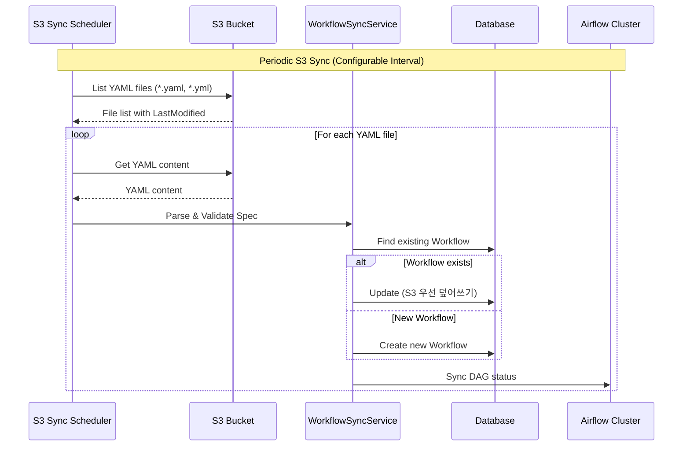
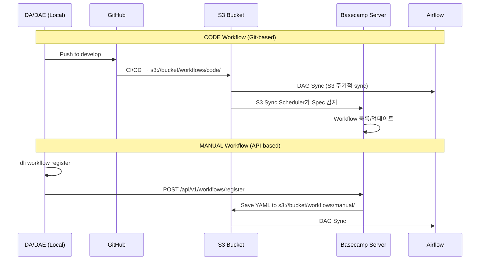

# Airflow Integration Feature Specification

> **Version:** 2.0.0 | **Status:** ✅ Implemented | **Priority:** P5 Airflow
> **Dependencies:** WORKFLOW_RELEASE.md (100% complete)
>
> **📦 Data Source:** Self-managed JPA (상태 저장) + External API (Airflow REST API - Airflow 3 기준)
> **Entities:** `WorkflowEntity`, `WorkflowRunEntity`, `AirflowClusterEntity`

---

## 1. Overview

### 1.1 Purpose

Basecamp Server와 Apache Airflow 실제 연동을 통한 프로덕션 워크플로우 오케스트레이션 구현.

| 측면 | 현재 상태 | 목표 상태 |
|------|-----------|-----------|
| **DAG 실행** | MockAirflowClient (메모리 시뮬레이션) | Airflow REST API (Airflow 3 기준) 실제 호출 |
| **YAML 저장** | InMemoryWorkflowStorage | S3 (AWS SDK) 실제 저장 + S3 Mock (로컬) |
| **Spec Sync** | 없음 | S3에서 Dataset Spec 주기적 Sync |
| **클러스터 관리** | 없음 | 팀별 Airflow Cluster 관리 |

### 1.2 Deployment Architecture

**핵심 원칙:** Basecamp Server는 환경별로 배포되므로, 동일 환경 내에서 팀별 Cluster만 관리합니다.

```
┌─────────────────────────────────────────────────────────────────────────────┐
│                         Environment-based Deployment                        │
├─────────────────────────────────────────────────────────────────────────────┤
│                                                                             │
│   DEV Environment                      PROD Environment                     │
│   ┌─────────────────────┐             ┌─────────────────────┐              │
│   │  Basecamp Server    │             │  Basecamp Server    │              │
│   │  (DEV)              │             │  (PROD)             │              │
│   └──────────┬──────────┘             └──────────┬──────────┘              │
│              │                                   │                          │
│       ┌──────┴──────┐                     ┌──────┴──────┐                  │
│       ▼             ▼                     ▼             ▼                  │
│   ┌───────┐    ┌───────┐             ┌───────┐    ┌───────┐               │
│   │Team A │    │Team B │             │Team A │    │Team B │               │
│   │Airflow│    │Airflow│             │Airflow│    │Airflow│               │
│   │(DEV)  │    │(DEV)  │             │(PROD) │    │(PROD) │               │
│   └───────┘    └───────┘             └───────┘    └───────┘               │
│                                                                             │
└─────────────────────────────────────────────────────────────────────────────┘
```

### 1.3 Scope

**In Scope:**
- `AirflowClient` 실제 구현 (현재 `MockAirflowClient` → `RestAirflowClient`)
- `WorkflowStorage` 실제 구현 (현재 `InMemoryWorkflowStorage` → `S3WorkflowStorage`)
- **S3 Spec Sync 서비스** (핵심 기능): S3에서 Dataset Spec을 주기적으로 가져와 Workflow 등록
- **S3 Mock** 구현 (로컬 개발 환경용)
- `AirflowClusterEntity` 통합 (GITHUB_FEATURE.md에서 이관)
- 팀별 Airflow Cluster 지원 (동일 환경 내)

**Out of Scope:**
- 권한/보안 체계 (Phase 2에서 구현)
- DAG 코드 자동 생성 (기존 DAG 패턴 활용)
- Airflow UI 통합
- Cluster 등록 API (관리자가 DB로 직접 등록)

---

## 2. System Architecture

### 2.1 Data Source Classification

| 데이터 소스 | 타입 | 관리 주체 | 설명 |
|-------------|------|-----------|------|
| `WorkflowEntity` | Self-managed JPA | Basecamp Server | 워크플로우 등록/상태 관리 |
| `WorkflowRunEntity` | Self-managed JPA | Basecamp Server | 실행 이력 추적 |
| `AirflowClusterEntity` | Self-managed JPA | 관리자 (DB 직접) | 팀별 클러스터 설정 |
| Airflow DAG Runs | External API | Airflow | DAG 실행 상태 (polling) |
| YAML Specs | External Storage | S3 | 워크플로우 정의 파일 |

### 2.2 High-Level Architecture

```
┌─────────────────────────────────────────────────────────────────────────────┐
│                              Data Flow                                       │
├─────────────────────────────────────────────────────────────────────────────┤
│                                                                              │
│   ┌─────────┐         ┌──────────────────┐         ┌─────────────────┐      │
│   │  dli    │ ──────► │  Basecamp Server │ ──────► │    Airflow      │      │
│   │  CLI    │         │                  │         │   (Team별)      │      │
│   └─────────┘         │  ┌────────────┐  │         └────────┬────────┘      │
│                       │  │ Workflow   │  │                  │               │
│                       │  │ Service    │  │                  │               │
│                       │  └──────┬─────┘  │                  │               │
│                       │         │        │                  │               │
│   ┌─────────┐         │  ┌──────┴─────┐  │                  ▼               │
│   │  S3     │ ◄─────► │  │ S3 Sync    │  │          ┌───────────────┐       │
│   │ Bucket  │  Sync   │  │ Scheduler  │  │          │  S3 (DAGs)    │       │
│   │(Specs)  │         │  └────────────┘  │          │  manual/      │       │
│   └─────────┘         └──────────────────┘          │  code/        │       │
│                                                     └───────────────┘       │
└─────────────────────────────────────────────────────────────────────────────┘
```

### 2.3 S3 Spec Sync Workflow (핵심 기능)



### 2.4 DAG Deployment Workflow



---

## 3. Domain Model (GITHUB_FEATURE.md에서 이관)

### 3.1 AirflowClusterEntity

```kotlin
@Entity
@Table(
    name = "airflow_clusters",
    indexes = [
        Index(name = "idx_airflow_cluster_team", columnList = "team", unique = true),
        Index(name = "idx_airflow_cluster_env", columnList = "environment"),
        Index(name = "idx_airflow_cluster_active", columnList = "is_active"),
    ],
)
class AirflowClusterEntity(
    @Id
    @GeneratedValue(strategy = GenerationType.IDENTITY)
    val id: Long = 0,

    // 팀 식별자 - 동일 환경 내 팀별 1개 클러스터 (UNIQUE)
    @Column(nullable = false, length = 255, unique = true)
    val team: String,

    @Column(nullable = false, length = 100)
    val clusterName: String,

    @Column(nullable = false, length = 500)
    val airflowUrl: String,

    // 환경 정보 (관리/메타데이터 목적, 라우팅에는 미사용)
    @Enumerated(EnumType.STRING)
    @Column(nullable = false, length = 50)
    val environment: AirflowEnvironment,

    @Column(nullable = false, length = 500)
    val dagS3Path: String,

    @Column(nullable = false, length = 200)
    val dagNamePrefix: String,

    @Column(nullable = false)
    val isActive: Boolean = true,

    // Airflow 3 JWT Token (API Key) 인증
    @Column(nullable = false, length = 500)
    val apiKey: String,

    @Column(length = 1000)
    val description: String? = null,
) : BaseAuditableEntity()

enum class AirflowEnvironment {
    DEVELOPMENT, PRODUCTION
}
```

### 3.2 Database Schema

```sql
-- Airflow Clusters Table
CREATE TABLE airflow_clusters (
    id BIGINT AUTO_INCREMENT PRIMARY KEY,
    team VARCHAR(255) NOT NULL,
    cluster_name VARCHAR(100) NOT NULL,
    airflow_url VARCHAR(500) NOT NULL,
    environment VARCHAR(50) NOT NULL,
    dag_s3_path VARCHAR(500) NOT NULL,
    dag_name_prefix VARCHAR(200) NOT NULL,
    is_active BOOLEAN NOT NULL DEFAULT TRUE,
    api_key VARCHAR(500) NOT NULL,
    description VARCHAR(1000),
    created_at TIMESTAMP DEFAULT CURRENT_TIMESTAMP,
    updated_at TIMESTAMP DEFAULT CURRENT_TIMESTAMP ON UPDATE CURRENT_TIMESTAMP,
    created_by BIGINT,  -- BaseAuditableEntity 패턴과 일치 (User ID)
    updated_by BIGINT,  -- BaseAuditableEntity 패턴과 일치 (User ID)

    UNIQUE KEY uk_airflow_cluster_team (team),
    INDEX idx_airflow_cluster_env (environment),
    INDEX idx_airflow_cluster_active (is_active),
    INDEX idx_airflow_cluster_name (cluster_name)
);
```

### 3.3 Repository Layer

```kotlin
// Domain Interface (module-core-domain)
interface AirflowClusterRepositoryJpa {
    fun save(cluster: AirflowClusterEntity): AirflowClusterEntity
    fun findById(id: Long): AirflowClusterEntity?
    fun findByTeam(team: String): AirflowClusterEntity?
    fun findAllActive(): List<AirflowClusterEntity>
    fun deleteById(id: Long)
}

interface AirflowClusterRepositoryDsl {
    fun findByAirflowUrl(url: String): AirflowClusterEntity?
    fun findByClusterName(name: String): List<AirflowClusterEntity>
}

// Infrastructure Implementation (module-core-infra)
@Repository("airflowClusterRepositoryJpa")
class AirflowClusterRepositoryJpaImpl(
    private val springDataRepository: AirflowClusterRepositoryJpaSpringData,
) : AirflowClusterRepositoryJpa {
    override fun findByTeam(team: String): AirflowClusterEntity? =
        springDataRepository.findByTeamAndIsActiveTrue(team)
    // ... 기타 메서드 구현
}
```

---

## 4. S3 Sync Service (핵심 기능)

### 4.1 WorkflowSyncService

```kotlin
@Service
class WorkflowSyncService(
    private val workflowStorage: WorkflowStorage,
    private val workflowService: WorkflowService,
    private val yamlParser: WorkflowYamlParser,
) {
    private val log = LoggerFactory.getLogger(javaClass)

    /**
     * S3에서 모든 YAML Spec을 가져와 Workflow로 동기화
     * - S3 우선 정책: 기존 Workflow가 있으면 덮어쓰기
     */
    @Transactional
    fun syncFromS3(): SyncResult {
        val specs = workflowStorage.listAllSpecs()
        var created = 0
        var updated = 0
        var failed = 0
        val errors = mutableListOf<SyncError>()

        specs.forEach { specPath ->
            try {
                val yamlContent = workflowStorage.getWorkflowYaml(specPath)
                val spec = yamlParser.parse(yamlContent)

                val existing = workflowService.findByDatasetName(spec.datasetName)
                if (existing != null) {
                    workflowService.updateFromSpec(existing.id, spec, specPath)
                    updated++
                    log.info("Updated workflow: {} from {}", spec.datasetName, specPath)
                } else {
                    workflowService.createFromSpec(spec, specPath)
                    created++
                    log.info("Created workflow: {} from {}", spec.datasetName, specPath)
                }
            } catch (e: Exception) {
                failed++
                errors.add(SyncError(specPath, e.message ?: "Unknown error"))
                log.error("Failed to sync spec: {}", specPath, e)
            }
        }

        return SyncResult(
            totalProcessed = specs.size,
            created = created,
            updated = updated,
            failed = failed,
            errors = errors,
            syncedAt = Instant.now()
        )
    }
}

data class SyncResult(
    val totalProcessed: Int,
    val created: Int,
    val updated: Int,
    val failed: Int,
    val errors: List<SyncError>,
    val syncedAt: Instant
)

data class SyncError(
    val specPath: String,
    val message: String
)
```

### 4.2 S3 Sync Scheduler

```kotlin
@Component
@ConditionalOnProperty("basecamp.workflow.sync.enabled", havingValue = "true")
class WorkflowSyncScheduler(
    private val syncService: WorkflowSyncService,
    @Value("\${basecamp.workflow.sync.cron:0 */5 * * * *}") private val cronExpression: String,
) {
    private val log = LoggerFactory.getLogger(javaClass)

    @Scheduled(cron = "\${basecamp.workflow.sync.cron:0 */5 * * * *}")
    fun scheduledSync() {
        log.info("Starting scheduled S3 sync...")
        try {
            val result = syncService.syncFromS3()
            log.info("S3 sync completed: created={}, updated={}, failed={}",
                result.created, result.updated, result.failed)
        } catch (e: Exception) {
            log.error("S3 sync failed", e)
        }
    }
}
```

### 4.3 Manual Sync API

```kotlin
@RestController
@RequestMapping("/api/v1/admin/sync")
class SyncController(
    private val syncService: WorkflowSyncService,
) {
    /**
     * 수동 S3 Sync 트리거 (관리자용)
     */
    @PostMapping("/workflows")
    fun triggerSync(): ResponseEntity<SyncResult> {
        val result = syncService.syncFromS3()
        return ResponseEntity.ok(result)
    }
}
```

---

## 5. DAG Run Sync Service (Airflow 상태 동기화)

### 5.1 Overview

Workflow API의 GET 엔드포인트(run/history/status)가 Airflow의 실제 실행 데이터를 반환하도록 주기적으로 Airflow 클러스터에서 DAG Run 데이터를 가져와 로컬 DB에 저장합니다.

**설계 근거:**
- 다수의 Airflow 클러스터가 존재하므로 실시간 API 호출 시 지연 발생
- Airflow 클러스터 장애 시에도 캐시된 데이터로 서비스 지속 가능
- DB 조회가 외부 API 호출보다 빠르고 안정적

```
┌─────────────────────────────────────────────────────────────────────────────┐
│                        DAG Run Sync Flow                                     │
├─────────────────────────────────────────────────────────────────────────────┤
│                                                                              │
│   Airflow Clusters          Basecamp Server                    CLI/API      │
│   ┌──────────────┐         ┌─────────────────┐              ┌──────────┐   │
│   │ Team A       │         │                 │              │          │   │
│   │ Airflow      │◄──────► │  AirflowRun     │              │  dli     │   │
│   └──────────────┘  Sync   │  SyncService    │              │ workflow │   │
│   ┌──────────────┐         │                 │              │  status  │   │
│   │ Team B       │◄──────► │       ↓         │              └────┬─────┘   │
│   │ Airflow      │         │                 │                   │         │
│   └──────────────┘         │  WorkflowRun    │◄──────────────────┘         │
│                            │  Entity (DB)    │    Query (DB, not Airflow)  │
│                            └─────────────────┘                              │
│                                                                              │
└─────────────────────────────────────────────────────────────────────────────┘
```

### 5.2 WorkflowRunEntity 확장

```kotlin
// 기존 필드에 Airflow 연동용 필드 추가
@Entity
@Table(name = "workflow_runs")
class WorkflowRunEntity(
    // ... 기존 필드 유지 ...

    // === Airflow 연동 필드 (신규) ===

    /**
     * Airflow의 실제 DAG Run ID
     * 형식: {dag_id}__{logical_date} (Airflow 기본 패턴)
     */
    @Column(name = "airflow_dag_run_id", length = 255)
    var airflowDagRunId: String? = null,

    /**
     * Airflow의 원본 상태값 (queued, running, success, failed 등)
     */
    @Column(name = "airflow_state", length = 50)
    var airflowState: String? = null,

    /**
     * Airflow UI에서 해당 Run을 볼 수 있는 URL
     */
    @Column(name = "airflow_url", length = 1000)
    var airflowUrl: String? = null,

    /**
     * 마지막으로 Airflow에서 동기화된 시간
     */
    @Column(name = "last_synced_at")
    var lastSyncedAt: LocalDateTime? = null,

    /**
     * Airflow 클러스터 ID (어느 클러스터에서 실행되었는지)
     */
    @Column(name = "airflow_cluster_id")
    var airflowClusterId: Long? = null,

    /**
     * Task 진행 상황 (JSON)
     * {"total": 10, "completed": 5, "failed": 0, "running": 2}
     */
    @Column(name = "task_progress", columnDefinition = "TEXT")
    var taskProgress: String? = null,
) : BaseEntity() {

    /**
     * Airflow 상태로 업데이트
     */
    fun updateFromAirflow(
        airflowState: String,
        airflowUrl: String?,
        taskProgress: String?,
        startedAt: LocalDateTime?,
        endedAt: LocalDateTime?,
    ) {
        this.airflowState = airflowState
        this.airflowUrl = airflowUrl
        this.taskProgress = taskProgress
        this.lastSyncedAt = LocalDateTime.now()

        // Airflow 상태 → 내부 상태 매핑
        this.status = mapAirflowState(airflowState)

        // 시간 업데이트 (Airflow 데이터 우선)
        if (startedAt != null && this.startedAt == null) {
            this.startedAt = startedAt
        }
        if (endedAt != null && this.endedAt == null) {
            this.endedAt = endedAt
        }
    }

    private fun mapAirflowState(state: String): WorkflowRunStatus {
        return when (state.lowercase()) {
            "queued" -> WorkflowRunStatus.PENDING
            "running", "restarting" -> WorkflowRunStatus.RUNNING
            "success" -> WorkflowRunStatus.SUCCESS
            "failed", "upstream_failed" -> WorkflowRunStatus.FAILED
            "skipped" -> WorkflowRunStatus.SKIPPED
            else -> WorkflowRunStatus.UNKNOWN
        }
    }
}

// ⚠️ WorkflowRunStatus Enum 확장 필요 (module-core-domain/model/workflow/WorkflowEnums.kt)
// 기존 enum에 SKIPPED, UNKNOWN 추가:
// enum class WorkflowRunStatus {
//     PENDING, RUNNING, SUCCESS, FAILED, STOPPING, STOPPED, SKIPPED, UNKNOWN
// }
```

### 5.3 Database Schema 확장

```sql
-- WorkflowRunEntity 테이블에 Airflow 연동 컬럼 추가
ALTER TABLE workflow_runs ADD COLUMN airflow_dag_run_id VARCHAR(255);
ALTER TABLE workflow_runs ADD COLUMN airflow_state VARCHAR(50);
ALTER TABLE workflow_runs ADD COLUMN airflow_url VARCHAR(1000);
ALTER TABLE workflow_runs ADD COLUMN last_synced_at TIMESTAMP;
ALTER TABLE workflow_runs ADD COLUMN airflow_cluster_id BIGINT;
ALTER TABLE workflow_runs ADD COLUMN task_progress TEXT;

-- 인덱스 추가
CREATE INDEX idx_workflow_runs_airflow_dag_run_id ON workflow_runs(airflow_dag_run_id);
CREATE INDEX idx_workflow_runs_last_synced_at ON workflow_runs(last_synced_at);
CREATE INDEX idx_workflow_runs_airflow_cluster_id ON workflow_runs(airflow_cluster_id);
```

### 5.4 Repository Interface 확장

```kotlin
// module-core-domain/repository/WorkflowRunRepositoryJpa.kt 확장
interface WorkflowRunRepositoryJpa {
    // ... 기존 메서드 ...

    /**
     * Airflow DAG Run ID로 조회 (동기화용)
     */
    fun findByAirflowDagRunId(dagRunId: String): WorkflowRunEntity?
}

// module-core-domain/repository/WorkflowRunRepositoryDsl.kt 확장
interface WorkflowRunRepositoryDsl {
    // ... 기존 메서드 ...

    /**
     * 특정 클러스터의 진행 중인 Run 조회 (동기화용)
     * @param clusterId Airflow 클러스터 ID
     * @param since 조회 시작 시점
     */
    fun findPendingRunsByCluster(
        clusterId: Long,
        since: LocalDateTime
    ): List<WorkflowRunEntity>
}
```

### 5.5 AirflowService

```kotlin
@Service
class AirflowService(
    private val airflowClient: AirflowClient,
    private val clusterRepository: AirflowClusterRepositoryJpa,
    private val workflowRunRepositoryJpa: WorkflowRunRepositoryJpa,
    private val workflowRunRepositoryDsl: WorkflowRunRepositoryDsl,
    private val objectMapper: ObjectMapper,  // Jackson ObjectMapper
    @Value("\${basecamp.workflow.run-sync.lookback-hours:24}") private val lookbackHours: Int,
    @Value("\${basecamp.workflow.run-sync.batch-size:100}") private val batchSize: Int,
    @Value("\${basecamp.workflow.run-sync.stale-threshold-hours:1}") private val staleThresholdHours: Int,
) {
    private val log = LoggerFactory.getLogger(javaClass)

    /**
     * 모든 활성 Airflow 클러스터에서 DAG Run 데이터 동기화
     */
    @Transactional
    fun syncAllClusters(): RunSyncResult {
        val clusters = clusterRepository.findAllActive()
        val results = mutableListOf<ClusterSyncResult>()

        clusters.forEach { cluster ->
            try {
                val clusterResult = syncClusterInternal(cluster)
                results.add(clusterResult)
                log.info("Synced cluster {}: {} runs updated", cluster.clusterName, clusterResult.updatedCount)
            } catch (e: Exception) {
                log.error("Failed to sync cluster {}: {}", cluster.clusterName, e.message)
                results.add(ClusterSyncResult(cluster.clusterName, 0, 0, e.message))
            }
        }

        return RunSyncResult(
            totalClusters = clusters.size,
            clusterResults = results,
            syncedAt = Instant.now()
        )
    }

    /**
     * 특정 클러스터의 DAG Run 데이터 동기화 (클러스터 ID로)
     * Admin API에서 사용
     */
    fun syncCluster(clusterId: Long): ClusterSyncResult {
        val cluster = clusterRepository.findById(clusterId)
            ?: return ClusterSyncResult("unknown", 0, 0, "Cluster not found: $clusterId")
        return syncClusterInternal(cluster)
    }

    /**
     * 특정 클러스터의 DAG Run 데이터 동기화 (내부용)
     */
    private fun syncClusterInternal(cluster: AirflowClusterEntity): ClusterSyncResult {
        val cutoffTime = LocalDateTime.now().minusHours(lookbackHours.toLong())
        var updatedCount = 0
        var createdCount = 0

        // 1. 해당 클러스터에 속한 진행 중인 Run 조회 (DB)
        val pendingRuns = workflowRunRepositoryDsl.findPendingRunsByCluster(
            clusterId = cluster.id,
            since = cutoffTime
        )

        // 2. Airflow에서 최근 DAG Run 목록 조회
        val dagRuns = airflowClient.listRecentDagRuns(
            since = cutoffTime,
            limit = batchSize
        )

        // 3. 각 DAG Run에 대해 로컬 데이터 업데이트
        dagRuns.forEach { airflowRun ->
            val existing = workflowRunRepositoryJpa.findByAirflowDagRunId(airflowRun.dagRunId)

            if (existing != null) {
                // 기존 Run 업데이트
                existing.updateFromAirflow(
                    airflowState = airflowRun.state,
                    airflowUrl = buildAirflowUrl(cluster, airflowRun),
                    taskProgress = fetchTaskProgress(airflowRun),
                    startedAt = airflowRun.startDate,
                    endedAt = airflowRun.endDate
                )
                workflowRunRepositoryJpa.save(existing)
                updatedCount++
            } else {
                // Basecamp에서 트리거되지 않은 Run (외부 트리거)은 스킵 또는 생성
                // 정책에 따라 결정 (현재는 스킵)
                log.debug("Skipping external run: {}", airflowRun.dagRunId)
            }
        }

        // 4. DB에는 있지만 Airflow에서 완료된 Run 확인 (오래된 Pending 상태 정리)
        pendingRuns.filter { run ->
            dagRuns.none { it.dagRunId == run.airflowDagRunId }
        }.forEach { staleRun ->
            // Airflow에서 조회되지 않는 오래된 Pending 상태 처리
            if (staleRun.startedAt?.isBefore(cutoffTime.minusHours(staleThresholdHours.toLong())) == true) {
                log.warn("Marking stale run as unknown: {}", staleRun.runId)
                staleRun.status = WorkflowRunStatus.UNKNOWN
                staleRun.lastSyncedAt = LocalDateTime.now()
                workflowRunRepositoryJpa.save(staleRun)
            }
        }

        return ClusterSyncResult(cluster.clusterName, updatedCount, createdCount, null)
    }

    private fun buildAirflowUrl(cluster: AirflowClusterEntity, run: AirflowDagRun): String {
        return "${cluster.airflowUrl}/dags/${run.dagId}/grid?dag_run_id=${run.dagRunId}"
    }

    private fun fetchTaskProgress(run: AirflowDagRun): String? {
        // Task Instance 조회하여 진행 상황 생성
        return try {
            val instances = airflowClient.getTaskInstances(run.dagId, run.dagRunId)
            val progress = TaskProgress(
                total = instances.size,
                completed = instances.count { it.state == "success" },
                failed = instances.count { it.state == "failed" },
                running = instances.count { it.state == "running" }
            )
            objectMapper.writeValueAsString(progress)
        } catch (e: Exception) {
            log.warn("Failed to fetch task progress for {}: {}", run.dagRunId, e.message)
            null
        }
    }
}

data class RunSyncResult(
    val totalClusters: Int,
    val clusterResults: List<ClusterSyncResult>,
    val syncedAt: Instant
)

data class ClusterSyncResult(
    val clusterName: String,
    val updatedCount: Int,
    val createdCount: Int,
    val error: String?
)

data class TaskProgress(
    val total: Int,
    val completed: Int,
    val failed: Int,
    val running: Int
)
```

### 5.6 AirflowSyncScheduler

```kotlin
@Component
@ConditionalOnProperty("basecamp.workflow.run-sync.enabled", havingValue = "true")
class AirflowSyncScheduler(
    private val syncService: AirflowService,
) {
    private val log = LoggerFactory.getLogger(javaClass)

    @Scheduled(cron = "\${basecamp.workflow.run-sync.cron:0 */2 * * * *}")
    fun scheduledSync() {
        log.info("Starting scheduled DAG Run sync...")
        try {
            val result = syncService.syncAllClusters()
            val totalUpdated = result.clusterResults.sumOf { it.updatedCount }
            log.info("DAG Run sync completed: {} clusters, {} runs updated",
                result.totalClusters, totalUpdated)
        } catch (e: Exception) {
            log.error("DAG Run sync failed", e)
        }
    }
}
```

### 5.7 AirflowClient 인터페이스 확장

> **Note:** 이 메서드들은 §6.4 `AirflowClient` 인터페이스에 추가되어야 합니다.

```kotlin
// AirflowClient 인터페이스에 추가할 메서드
interface AirflowClient {
    // ... 기존 메서드 ...

    /**
     * 최근 DAG Run 목록 조회 (동기화용)
     */
    fun listRecentDagRuns(since: LocalDateTime, limit: Int = 100): List<AirflowDagRun>

    /**
     * 특정 DAG Run의 Task Instance 목록 조회
     */
    fun getTaskInstances(dagId: String, dagRunId: String): List<AirflowTaskInstance>
}

data class AirflowDagRun(
    val dagId: String,
    val dagRunId: String,
    val state: String,
    val logicalDate: LocalDateTime?,
    val startDate: LocalDateTime?,
    val endDate: LocalDateTime?,
    val conf: Map<String, Any>?
)

data class AirflowTaskInstance(
    val taskId: String,
    val state: String,
    val startDate: LocalDateTime?,
    val endDate: LocalDateTime?,
    val tryNumber: Int
)
```

### 5.8 Manual Sync API

```kotlin
@RestController
@RequestMapping("/api/v1/admin/sync")
class SyncController(
    private val workflowSyncService: WorkflowSyncService,
    private val runSyncService: AirflowService,  // 추가
) {
    /**
     * 수동 S3 Spec Sync 트리거
     */
    @PostMapping("/workflows")
    fun triggerWorkflowSync(): ResponseEntity<SyncResult> {
        val result = workflowSyncService.syncFromS3()
        return ResponseEntity.ok(result)
    }

    /**
     * 수동 DAG Run Sync 트리거 (신규)
     */
    @PostMapping("/runs")
    fun triggerRunSync(): ResponseEntity<RunSyncResult> {
        val result = runSyncService.syncAllClusters()
        return ResponseEntity.ok(result)
    }

    /**
     * 특정 클러스터의 DAG Run Sync 트리거
     */
    @PostMapping("/runs/cluster/{clusterId}")
    fun triggerClusterRunSync(@PathVariable clusterId: Long): ResponseEntity<ClusterSyncResult> {
        val result = runSyncService.syncCluster(clusterId)
        return ResponseEntity.ok(result)
    }
}
```

### 5.9 Configuration

```yaml
# application.yml
basecamp:
  workflow:
    # ... 기존 설정 ...

    run-sync:
      enabled: true
      cron: "0 */2 * * * *"        # 2분마다 (조정 가능)
      lookback-hours: 24            # 최근 24시간 데이터 조회
      batch-size: 100               # 클러스터당 최대 조회 건수
      stale-threshold-hours: 1      # Stale run 판정 기준 시간

# 로컬 개발 환경
---
spring:
  config:
    activate:
      on-profile: local

basecamp:
  workflow:
    run-sync:
      enabled: false  # Mock 환경에서는 비활성화

# 프로덕션 환경
---
spring:
  config:
    activate:
      on-profile: prod

basecamp:
  workflow:
    run-sync:
      enabled: true
      cron: "0 */1 * * * *"        # 1분마다 (더 빈번하게)
      lookback-hours: 48            # 48시간
      stale-threshold-hours: 2      # PROD는 더 넉넉하게
```

---

## 6. Integration Components

### 6.1 WorkflowStorage Interface (Domain Port)

```kotlin
// module-core-domain/src/main/kotlin/.../external/WorkflowStorage.kt
interface WorkflowStorage {
    fun saveWorkflowYaml(datasetName: String, sourceType: WorkflowSourceType, yamlContent: String): String
    fun getWorkflowYaml(s3Path: String): String
    fun deleteWorkflowYaml(s3Path: String): Boolean
    fun existsWorkflowYaml(s3Path: String): Boolean
    fun listAllSpecs(): List<String>  // S3 Sync용
    fun listSpecsByPrefix(prefix: String): List<String>  // 디렉토리별 조회
}
```

### 6.2 S3WorkflowStorage (Infrastructure Adapter)

```kotlin
@Repository("workflowStorage")
@ConditionalOnProperty("basecamp.workflow.storage.type", havingValue = "s3")
class S3WorkflowStorage(
    private val s3Client: S3Client,
    @Value("\${basecamp.workflow.storage.bucket}") private val bucket: String,
    @Value("\${basecamp.workflow.storage.prefix:workflows}") private val prefix: String,
) : WorkflowStorage {

    override fun listAllSpecs(): List<String> {
        val request = ListObjectsV2Request.builder()
            .bucket(bucket)
            .prefix(prefix)
            .build()

        return s3Client.listObjectsV2(request)
            .contents()
            .filter { it.key().endsWith(".yaml") || it.key().endsWith(".yml") }
            .map { "s3://$bucket/${it.key()}" }
    }

    override fun saveWorkflowYaml(
        datasetName: String,
        sourceType: WorkflowSourceType,
        yamlContent: String
    ): String {
        val key = generateKey(datasetName, sourceType)
        val s3Path = "s3://$bucket/$key"

        s3Client.putObject(
            PutObjectRequest.builder()
                .bucket(bucket)
                .key(key)
                .contentType("text/yaml")
                .build(),
            RequestBody.fromString(yamlContent)
        )

        log.info("Saved workflow YAML to S3: {}", s3Path)
        return s3Path
    }

    override fun getWorkflowYaml(s3Path: String): String {
        val (bucket, key) = parseS3Path(s3Path)
        return s3Client.getObjectAsBytes(
            GetObjectRequest.builder()
                .bucket(bucket)
                .key(key)
                .build()
        ).asUtf8String()
    }

    // ... 기타 메서드 구현
}
```

### 6.3 MockS3WorkflowStorage (로컬 개발용)

```kotlin
@Repository("workflowStorage")
@ConditionalOnProperty("basecamp.workflow.storage.type", havingValue = "mock", matchIfMissing = true)
class MockS3WorkflowStorage(
    @Value("\${basecamp.workflow.storage.mock-dir:./mock-s3}") private val mockDir: String,
) : WorkflowStorage {

    private val log = LoggerFactory.getLogger(javaClass)
    private val basePath: Path by lazy { Path.of(mockDir).also { Files.createDirectories(it) } }

    override fun listAllSpecs(): List<String> {
        return Files.walk(basePath)
            .filter { Files.isRegularFile(it) }
            .filter { it.fileName.toString().endsWith(".yaml") || it.fileName.toString().endsWith(".yml") }
            .map { "mock-s3://${it.toAbsolutePath()}" }
            .toList()
    }

    override fun saveWorkflowYaml(
        datasetName: String,
        sourceType: WorkflowSourceType,
        yamlContent: String
    ): String {
        val subDir = if (sourceType == WorkflowSourceType.MANUAL) "manual" else "code"
        val filePath = basePath.resolve(subDir).resolve("$datasetName.yaml")
        Files.createDirectories(filePath.parent)
        Files.writeString(filePath, yamlContent)
        val mockPath = "mock-s3://${filePath.toAbsolutePath()}"
        log.info("Saved workflow YAML to mock S3: {}", mockPath)
        return mockPath
    }

    override fun getWorkflowYaml(s3Path: String): String {
        val path = parseMockPath(s3Path)
        return Files.readString(path)
    }

    override fun deleteWorkflowYaml(s3Path: String): Boolean {
        return try {
            val path = parseMockPath(s3Path)
            Files.deleteIfExists(path)
            true
        } catch (e: Exception) {
            log.warn("Failed to delete mock S3 file: {}", e.message)
            false
        }
    }

    override fun existsWorkflowYaml(s3Path: String): Boolean {
        val path = parseMockPath(s3Path)
        return Files.exists(path)
    }

    private fun parseMockPath(s3Path: String): Path {
        return Path.of(s3Path.removePrefix("mock-s3://"))
    }
}
```

### 6.4 AirflowClient Interface (Domain Port)

```kotlin
// module-core-domain/src/main/kotlin/.../external/AirflowClient.kt
interface AirflowClient {
    fun triggerDAGRun(dagId: String, runId: String, conf: Map<String, Any> = emptyMap()): String
    fun getDAGRun(dagId: String, runId: String): AirflowDAGRunStatus
    fun stopDAGRun(dagId: String, runId: String): Boolean
    fun pauseDAG(dagId: String, isPaused: Boolean): Boolean
    fun createDAG(datasetName: String, schedule: ScheduleInfo, s3Path: String): String  // 기존 메서드 유지
    fun deleteDAG(dagId: String): Boolean  // 기존 메서드 유지
    fun createBackfill(dagId: String, startDate: LocalDate, endDate: LocalDate): BackfillResponse
    fun getBackfill(dagId: String, backfillId: String): BackfillStatus  // dagId 파라미터 추가 (Cluster 식별용)
    fun cancelBackfill(dagId: String, backfillId: String): Boolean  // dagId 파라미터 추가 (Cluster 식별용)
    fun getDagStatus(dagId: String): AirflowDagStatus
    fun isAvailable(): Boolean
}
```

### 6.5 RestAirflowClient (Airflow 3 API 기준)

```kotlin
@Component("airflowClient")  // 외부 API Client는 @Component 사용 (기존 패턴 준수)
@ConditionalOnProperty("basecamp.workflow.client.type", havingValue = "airflow")
class RestAirflowClient(
    private val clusterRepository: AirflowClusterRepositoryJpa,
    private val restClientBuilder: RestClient.Builder,
) : AirflowClient {

    private val clientCache = ConcurrentHashMap<String, RestClient>()

    override fun triggerDAGRun(dagId: String, runId: String, conf: Map<String, Any>): String {
        val cluster = resolveCluster(dagId)
        val client = getOrCreateClient(cluster)

        // Airflow 3 API 스펙
        return client.post()
            .uri("/api/v1/dags/{dag_id}/dagRuns", dagId)
            .body(TriggerDagRunRequest(dagRunId = runId, conf = conf))
            .retrieve()
            .body(DagRunResponse::class.java)
            ?.dagRunId
            ?: throw AirflowIntegrationException("Failed to trigger DAG run")
    }

    /**
     * Airflow 3 Backfill API 사용
     * POST /api/v1/backfills
     */
    override fun createBackfill(dagId: String, startDate: LocalDate, endDate: LocalDate): BackfillResponse {
        val cluster = resolveCluster(dagId)
        val client = getOrCreateClient(cluster)

        return client.post()
            .uri("/api/v1/backfills")
            .body(CreateBackfillRequest(
                dagId = dagId,
                fromDate = startDate.atStartOfDay().atOffset(ZoneOffset.UTC).toString(),
                toDate = endDate.atStartOfDay().atOffset(ZoneOffset.UTC).toString()
            ))
            .retrieve()
            .body(BackfillResponse::class.java)
            ?: throw AirflowIntegrationException("Failed to create backfill")
    }

    override fun getBackfill(dagId: String, backfillId: String): BackfillStatus {
        val cluster = resolveCluster(dagId)  // dagId로 Cluster 식별
        val client = getOrCreateClient(cluster)

        return client.get()
            .uri("/api/v1/backfills/{backfill_id}", backfillId)
            .retrieve()
            .body(BackfillStatus::class.java)
            ?: throw AirflowIntegrationException("Backfill not found: $backfillId")
    }

    override fun cancelBackfill(dagId: String, backfillId: String): Boolean {
        val cluster = resolveCluster(dagId)  // dagId로 Cluster 식별
        val client = getOrCreateClient(cluster)

        return try {
            client.patch()
                .uri("/api/v1/backfills/{backfill_id}", backfillId)
                .body(UpdateBackfillRequest(isPaused = true))
                .retrieve()
                .toBodilessEntity()
            true
        } catch (e: Exception) {
            log.warn("Failed to cancel backfill: {}", e.message)
            false
        }
    }

    // 팀 기준 Cluster 라우팅 (동일 환경 내)
    private fun resolveCluster(dagId: String): AirflowClusterEntity {
        val team = extractTeamFromDagId(dagId)
        return clusterRepository.findByTeam(team)
            ?: throw AirflowClusterNotFoundException(team)
    }

    // Airflow 3 JWT Token (API Key) 인증
    private fun getOrCreateClient(cluster: AirflowClusterEntity): RestClient {
        return clientCache.computeIfAbsent(cluster.clusterName) {
            restClientBuilder
                .baseUrl(cluster.airflowUrl)
                .defaultHeaders { headers ->
                    headers.setBearerAuth(cluster.apiKey)  // JWT Token 인증
                }
                .build()
        }
    }
}
```

### 6.6 Airflow 3 API DTOs

```kotlin
// Trigger DAG Run
data class TriggerDagRunRequest(
    @JsonProperty("dag_run_id") val dagRunId: String,
    val conf: Map<String, Any> = emptyMap(),
    @JsonProperty("logical_date") val logicalDate: String? = null
)

data class DagRunResponse(
    @JsonProperty("dag_run_id") val dagRunId: String,
    @JsonProperty("dag_id") val dagId: String,
    val state: String,
    @JsonProperty("logical_date") val logicalDate: String?,
    @JsonProperty("start_date") val startDate: String?,
    @JsonProperty("end_date") val endDate: String?,
    val conf: Map<String, Any>?
)

// Backfill (Airflow 3)
data class CreateBackfillRequest(
    @JsonProperty("dag_id") val dagId: String,
    @JsonProperty("from_date") val fromDate: String,
    @JsonProperty("to_date") val toDate: String,
    @JsonProperty("max_active_runs") val maxActiveRuns: Int = 10,
    @JsonProperty("run_backwards") val runBackwards: Boolean = false
)

data class BackfillResponse(
    val id: String,
    @JsonProperty("dag_id") val dagId: String,
    @JsonProperty("from_date") val fromDate: String,
    @JsonProperty("to_date") val toDate: String,
    @JsonProperty("is_paused") val isPaused: Boolean,
    @JsonProperty("created_at") val createdAt: String
)

data class BackfillStatus(
    val id: String,
    @JsonProperty("dag_id") val dagId: String,
    @JsonProperty("from_date") val fromDate: String,
    @JsonProperty("to_date") val toDate: String,
    @JsonProperty("is_paused") val isPaused: Boolean,
    @JsonProperty("completed_at") val completedAt: String?
)

data class UpdateBackfillRequest(
    @JsonProperty("is_paused") val isPaused: Boolean
)
```

---

## 6. API Mapping

### 6.1 Basecamp Server API → Airflow 3 REST API

| Basecamp API | Method | Airflow 3 REST API | Description |
|--------------|--------|-------------------|-------------|
| `POST /api/v1/workflows/{name}/run` | triggerDAGRun | `POST /api/v1/dags/{dag_id}/dagRuns` | DAG 실행 트리거 |
| `GET /api/v1/workflows/runs/{run_id}` | getDAGRun | `GET /api/v1/dags/{dag_id}/dagRuns/{run_id}` | 실행 상태 조회 |
| `POST /api/v1/workflows/runs/{run_id}/stop` | stopDAGRun | `PATCH /api/v1/dags/{dag_id}/dagRuns/{run_id}` | 실행 중지 |
| `POST /api/v1/workflows/{name}/pause` | pauseDAG | `PATCH /api/v1/dags/{dag_id}` | DAG 일시정지 |
| `POST /api/v1/workflows/{name}/unpause` | pauseDAG | `PATCH /api/v1/dags/{dag_id}` | DAG 재개 |
| `POST /api/v1/workflows/{name}/backfill` | createBackfill | `POST /api/v1/backfills` | Backfill 생성 (Airflow 3) |
| `GET /api/v1/workflows/backfills/{id}` | getBackfill | `GET /api/v1/backfills/{id}` | Backfill 상태 조회 |
| `POST /api/v1/workflows/backfills/{id}/cancel` | cancelBackfill | `PATCH /api/v1/backfills/{id}` | Backfill 취소 |

### 6.2 Airflow 3 DAG Run State Mapping

| Airflow State | Basecamp RunStatus | Description |
|---------------|-------------------|-------------|
| `queued` | `PENDING` | 대기열 |
| `running` | `RUNNING` | 실행 중 |
| `success` | `SUCCESS` | 성공 |
| `failed` | `FAILED` | 실패 |
| `upstream_failed` | `FAILED` | 업스트림 실패 |
| `skipped` | `SKIPPED` | 건너뜀 |
| `restarting` | `RUNNING` | 재시작 중 |

---

## 7. Configuration

### 7.1 Application Configuration

```yaml
# application.yml
# 네임스페이스: basecamp.workflow.* (기존 basecamp.* 패턴 준수)
basecamp:
  workflow:
    client:
      type: mock   # mock | airflow
      connection-timeout: 10s
      read-timeout: 30s
      retry:
        max-attempts: 3
        delay: 1s
        multiplier: 2.0

    storage:
      type: mock   # mock | s3
      bucket: company-workflows
      prefix: workflows
      region: us-west-2
      mock-dir: ./mock-s3  # Mock 모드용 로컬 디렉토리

    sync:
      enabled: true
      cron: "0 */5 * * * *"  # 5분마다 (설정 가능)

# 로컬 개발 환경
---
spring:
  config:
    activate:
      on-profile: local

basecamp:
  workflow:
    client:
      type: mock
    storage:
      type: mock
      mock-dir: ./mock-s3
    sync:
      enabled: true
      cron: "0 */1 * * * *"  # 1분마다 (개발용)

# 프로덕션 환경
---
spring:
  config:
    activate:
      on-profile: prod

basecamp:
  workflow:
    client:
      type: airflow
    storage:
      type: s3
      bucket: ${WORKFLOW_S3_BUCKET}
      prefix: workflows
      region: ${AWS_REGION}
    sync:
      enabled: true
      cron: "0 */5 * * * *"
```

### 7.2 Sample Cluster Data (관리자 직접 등록)

```sql
-- DEV 환경 예시
INSERT INTO airflow_clusters (team, cluster_name, airflow_url, environment, dag_s3_path, dag_name_prefix, is_active, api_key, description)
VALUES
('@data-platform', 'dp-airflow', 'https://airflow.dev.company.com', 'DEVELOPMENT', 's3://company-workflows-dev/', 'dp', true, '${AIRFLOW_API_KEY}', 'Data Platform Team Airflow'),
('@analytics', 'analytics-airflow', 'https://airflow-analytics.dev.company.com', 'DEVELOPMENT', 's3://analytics-workflows-dev/', 'an', true, '${AIRFLOW_API_KEY}', 'Analytics Team Airflow');
```

---

## 8. Error Handling

### 8.1 Exception Hierarchy

```kotlin
// module-core-infra/exception/AirflowIntegrationException.kt
// (외부 시스템 연동 예외는 Infra 모듈에 배치)
sealed class AirflowIntegrationException(message: String, cause: Throwable? = null)
    : RuntimeException(message, cause) {

    class ConnectionFailed(url: String, cause: Throwable)
        : AirflowIntegrationException("Failed to connect to Airflow at $url", cause)

    class AuthenticationFailed(url: String)
        : AirflowIntegrationException("JWT authentication failed for Airflow at $url")

    class DagNotFound(dagId: String)
        : AirflowIntegrationException("DAG not found: $dagId")

    class DagRunNotFound(dagId: String, runId: String)
        : AirflowIntegrationException("DAG run not found: $dagId/$runId")

    class BackfillNotFound(backfillId: String)
        : AirflowIntegrationException("Backfill not found: $backfillId")

    class RateLimitExceeded(retryAfter: Duration)
        : AirflowIntegrationException("Rate limit exceeded, retry after $retryAfter")

    class ServerError(statusCode: Int, message: String)
        : AirflowIntegrationException("Airflow server error ($statusCode): $message")
}

class AirflowClusterNotFoundException(team: String)
    : RuntimeException("No active Airflow cluster found for team: $team")
```

### 8.2 Error Response Mapping

| Airflow HTTP Status | Basecamp Error Code | Description |
|---------------------|---------------------|-------------|
| 401 | `AIRFLOW_AUTH_FAILED` | JWT 인증 실패 |
| 403 | `AIRFLOW_PERMISSION_DENIED` | 권한 부족 |
| 404 | `AIRFLOW_DAG_NOT_FOUND` | DAG/Run 없음 |
| 429 | `AIRFLOW_RATE_LIMITED` | 요청 제한 |
| 500-599 | `AIRFLOW_SERVER_ERROR` | 서버 오류 |
| Connection Error | `AIRFLOW_CONNECTION_FAILED` | 연결 실패 |
| Timeout | `AIRFLOW_TIMEOUT` | 타임아웃 |

---

## 8.3 Migration Note: InMemoryWorkflowStorage

> **기존 코드 마이그레이션 필요**

현재 `InMemoryWorkflowStorage`는 `@ConditionalOnProperty` 없이 정의되어 있습니다.
새로운 `MockS3WorkflowStorage` 구현과 충돌을 방지하기 위해 다음 작업이 필요합니다:

```kotlin
// 기존 InMemoryWorkflowStorage에 조건부 활성화 추가
@Repository("workflowStorage")
@ConditionalOnProperty(
    "basecamp.workflow.storage.type",
    havingValue = "inmemory",  // 별도 타입으로 분리
    matchIfMissing = false     // 명시적 설정 필요
)
class InMemoryWorkflowStorage : WorkflowStorage {
    // 기존 구현...
}
```

**마이그레이션 순서:**
1. 기존 `InMemoryWorkflowStorage`에 `@ConditionalOnProperty` 추가
2. `MockS3WorkflowStorage` 구현 (파일시스템 기반)
3. `S3WorkflowStorage` 구현 (실제 S3)
4. 환경별 설정 적용 (`basecamp.workflow.storage.type`)

---

## 9. Implementation Checklist

### Phase 1: S3 Mock & Storage (Week 1-2, 우선순위 최고)

| 작업 | 의존성 | 예상 공수 |
|------|--------|-----------|
| [ ] `WorkflowStorage` 인터페이스 확장 (listAllSpecs 추가) | - | 0.5일 |
| [ ] `MockS3WorkflowStorage` 구현 (로컬 파일시스템 기반) | Interface | 1일 |
| [ ] `S3WorkflowStorage` 구현 (AWS SDK) | Interface | 1일 |
| [ ] `WorkflowYamlParser` 구현 (YAML 파싱) | - | 1일 |
| [ ] Unit Tests (Storage, Parser) | 구현 완료 | 1일 |

### Phase 2: S3 Sync Service (Week 2-3, 핵심 기능)

| 작업 | 의존성 | 예상 공수 |
|------|--------|-----------|
| [ ] `WorkflowSyncService` 구현 | Storage, Parser | 1.5일 |
| [ ] `WorkflowSyncScheduler` 구현 (Spring Scheduler) | SyncService | 0.5일 |
| [ ] 수동 Sync API 구현 | SyncService | 0.5일 |
| [ ] Integration Tests | 전체 | 1일 |

### Phase 3: AirflowCluster Entity (Week 3)

| 작업 | 의존성 | 예상 공수 |
|------|--------|-----------|
| [ ] `AirflowClusterEntity` 생성 | - | 0.5일 |
| [ ] `AirflowClusterRepository` 인터페이스/구현 | Entity | 0.5일 |
| [ ] Database Migration (DDL) | Entity | 0.5일 |
| [ ] Unit Tests (Entity, Repository) | 구현 완료 | 0.5일 |

### Phase 4: Airflow 3 Client Implementation (Week 4-5)

| 작업 | 의존성 | 예상 공수 |
|------|--------|-----------|
| [ ] Airflow 3 API DTO 정의 | - | 0.5일 |
| [ ] `RestAirflowClient` 기본 구현 (Airflow 3 기준) | Cluster Entity | 1.5일 |
| [ ] Backfill API 구현 (Airflow 3 /api/v1/backfills) | Client 기본 | 0.5일 |
| [ ] Resilience4j 통합 (Circuit Breaker, Retry) | Client 기본 | 0.5일 |
| [ ] Mock Airflow Server (WireMock) 테스트 | Client 구현 | 1일 |
| [ ] Integration Tests | 전체 | 1일 |

### Phase 5: DAG Run Sync Service (Week 5-6)

| 작업 | 의존성 | 예상 공수 |
|------|--------|-----------|
| [ ] `WorkflowRunEntity` 확장 (Airflow 연동 필드 추가) | - | 0.5일 |
| [ ] Database Migration (workflow_runs 테이블 확장) | Entity 수정 | 0.5일 |
| [ ] `AirflowService` 구현 | Phase 4 완료 | 1.5일 |
| [ ] `AirflowSyncScheduler` 구현 | SyncService | 0.5일 |
| [ ] 수동 Run Sync API 구현 | SyncService | 0.5일 |
| [ ] `AirflowClient` 확장 (listRecentDagRuns, getTaskInstances) | Client 기본 | 1일 |
| [ ] Unit Tests (SyncService) | 구현 완료 | 1일 |
| [ ] Integration Tests | 전체 | 1일 |

### Phase 6: WorkflowService Integration (Week 6-7)

| 작업 | 의존성 | 예상 공수 |
|------|--------|-----------|
| [ ] `WorkflowService` 수정 (Cluster 라우팅 적용) | Phase 5 완료 | 1일 |
| [ ] GET API 수정 (DB 조회로 변경, Airflow 직접 호출 제거) | Phase 5 완료 | 0.5일 |
| [ ] 환경별 Client 전환 로직 | Config | 0.5일 |
| [ ] End-to-End Tests | 전체 통합 | 1일 |
| [ ] Documentation 업데이트 | - | 0.5일 |

**총 예상 기간:** 7주 (1.75 FTE)

---

## 10. GITHUB_FEATURE.md 통합 완료

### 10.1 이관 항목

다음 내용이 GITHUB_FEATURE.md에서 본 문서로 이관되었습니다:

| 항목 | 원본 위치 | 상태 |
|------|-----------|------|
| `AirflowClusterEntity` | GITHUB_FEATURE.md § Domain Model | ✅ 이관 완료 |
| `AirflowClusterRepository` | GITHUB_FEATURE.md § Repository Layer | ✅ 이관 완료 |
| `AirflowEnvironment` enum | GITHUB_FEATURE.md § Domain Model | ✅ 이관 완료 |
| DDL: `airflow_clusters` 테이블 | GITHUB_FEATURE.md § Database Schema | ✅ 이관 완료 |

### 10.2 GITHUB_FEATURE.md에서 유지할 내용

GITHUB_FEATURE.md는 다음 내용만 유지:

- `GitHubRepositoryEntity` 및 관련 Repository
- GitHub API 연동 (Mock)
- GitHub ↔ S3 CI/CD 워크플로우 (개념만)

---

## 11. Dependencies

### 11.1 새로 추가될 의존성

```kotlin
// build.gradle.kts

// AWS SDK v2 for S3
implementation("software.amazon.awssdk:s3:2.29.x")
implementation("software.amazon.awssdk:sso:2.29.x")  // SSO 인증용

// YAML Parser
implementation("com.fasterxml.jackson.dataformat:jackson-dataformat-yaml")

// Resilience4j for Circuit Breaker
implementation("io.github.resilience4j:resilience4j-spring-boot3:2.2.x")
implementation("io.github.resilience4j:resilience4j-circuitbreaker:2.2.x")
implementation("io.github.resilience4j:resilience4j-retry:2.2.x")

// Test: LocalStack for S3, WireMock for Airflow
testImplementation("org.testcontainers:localstack:1.20.x")
testImplementation("org.wiremock:wiremock:3.10.x")
```

### 11.2 기존 의존성 활용

- Spring RestClient (Spring Boot 3.2+에 포함)
- Jackson (JSON 직렬화)
- Spring Data JPA (AirflowClusterEntity)
- Spring Scheduler (S3 Sync 스케줄링)

---

## 12. Appendix

### A. Airflow 3 REST API Reference

| Endpoint | Method | Description |
|----------|--------|-------------|
| `/api/v1/dags` | GET | DAG 목록 조회 |
| `/api/v1/dags/{dag_id}` | GET | DAG 상세 조회 |
| `/api/v1/dags/{dag_id}` | PATCH | DAG 수정 (pause/unpause) |
| `/api/v1/dags/{dag_id}/dagRuns` | GET | DAG Run 목록 |
| `/api/v1/dags/{dag_id}/dagRuns` | POST | DAG Run 생성 |
| `/api/v1/dags/{dag_id}/dagRuns/{run_id}` | GET | DAG Run 상세 |
| `/api/v1/dags/{dag_id}/dagRuns/{run_id}` | PATCH | DAG Run 수정 |
| `/api/v1/backfills` | POST | Backfill 생성 (Airflow 3) |
| `/api/v1/backfills/{backfill_id}` | GET | Backfill 상태 조회 |
| `/api/v1/backfills/{backfill_id}` | PATCH | Backfill 수정 (취소) |
| `/api/v1/health` | GET | 헬스체크 |

### B. Related Documents

| Document | Purpose |
|----------|---------|
| [`WORKFLOW_FEATURE.md`](./WORKFLOW_FEATURE.md) | Workflow API 명세 (100% 완료) |
| [`WORKFLOW_RELEASE.md`](./WORKFLOW_RELEASE.md) | Workflow API 구현 상세 |
| [`GITHUB_FEATURE.md`](./GITHUB_FEATURE.md) | GitHub 연동 (GitHubRepositoryEntity만 유지) |
| [Apache Airflow REST API](https://airflow.apache.org/docs/apache-airflow/stable/stable-rest-api-ref.html) | 공식 API 문서 |

---

**Document Version:** 2.2.0
**Created:** 2026-01-04
**Last Updated:** 2026-01-04

### Changelog

| Version | Date | Changes |
|---------|------|---------|
| 2.2.0 | 2026-01-04 | Implementation complete. All phases (1-6) implemented with Mock clients. |
| 2.1.1 | 2026-01-04 | Agent 리뷰 피드백 반영: H1-H4 수정 (Enum 확장 노트, Repository 확장 섹션, 모듈 경로, syncCluster public 메서드) |
| 2.1.0 | 2026-01-04 | DAG Run Sync Service 섹션 추가 (§5), Implementation Checklist Phase 5-6 추가 |
| 2.0.0 | 2026-01-04 | 초기 버전, GITHUB_FEATURE.md에서 Airflow 관련 내용 이관, 리뷰 피드백 반영 |

**Author:** Platform Integration Architect

---

## ✅ Implementation Complete

**Completed:** 2026-01-04
**Release Document:** [AIRFLOW_RELEASE.md](./AIRFLOW_RELEASE.md)

All phases (1-6) have been implemented:

| Phase | Feature | Status | Lines |
|-------|---------|--------|-------|
| **Phase 1** | S3 Storage Infrastructure | ✅ Complete | MockS3WorkflowStorage (373 lines) |
| **Phase 2** | S3 Spec Sync Service | ✅ Complete | WorkflowSpecSyncService (247 lines) + WorkflowYamlParser (154 lines) |
| **Phase 3** | AirflowClusterEntity | ✅ Complete | Entity + Repositories (~200 lines total) |
| **Phase 4** | AirflowClient Extension (Mock) | ✅ Complete | MockRestAirflowClient (573 lines) + DTOs (166 lines) |
| **Phase 5** | DAG Run Sync Service | ✅ Complete | AirflowService (340 lines) + Scheduler (120 lines) |
| **Phase 6** | WorkflowService Integration | ✅ Complete | AirflowSyncController (183 lines) + DTOs/Mapper (~190 lines) |

**API Endpoints Implemented:**
- `POST /api/v1/airflow/sync/manual/specs` - Manual S3 Spec Sync
- `POST /api/v1/airflow/sync/manual/runs` - Manual DAG Run Sync
- `POST /api/v1/airflow/sync/manual/runs/cluster/{id}` - Cluster-specific Run Sync
- `POST /api/v1/airflow/sync/manual/runs/stale` - Sync stale runs

**Test Coverage:** 100+ tests (~2,617 lines)

**Future Work (Production):**
- Real S3WorkflowStorage implementation (AWS SDK)
- Real RestAirflowClient implementation (Airflow 3 REST API)
- Resilience4j integration (Circuit Breaker, Retry)
