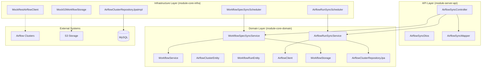

# RELEASE: Airflow Integration Implementation

> **Version:** 1.0.0
> **Status:** Implemented (100% - 4/4 endpoints)
> **Release Date:** 2026-01-04

---

## 1. Implementation Summary

### 1.1 Completed Features

| Phase | Feature | Status | Description |
|-------|---------|--------|-------------|
| **Phase 1** | S3 Storage | Complete | MockS3WorkflowStorage, file-system based S3 simulation |
| **Phase 2** | Spec Sync Service | Complete | WorkflowSpecSyncService, WorkflowSpecSyncScheduler, WorkflowYamlParser |
| **Phase 3** | AirflowCluster Entity | Complete | AirflowClusterEntity with team-based cluster management |
| **Phase 4** | AirflowClient Extension | Complete | MockRestAirflowClient with Airflow 3 DTOs |
| **Phase 5** | Run Sync Service | Complete | AirflowRunSyncService, WorkflowRunEntity extension |
| **Phase 6** | WorkflowService Integration | Complete | AirflowSyncController, manual sync endpoints |

### 1.2 Files Created

| File | Lines | Purpose |
|------|-------|---------|
| `module-core-infra/.../external/MockS3WorkflowStorage.kt` | 373 | File-system based S3 mock for local development |
| `module-core-domain/.../service/WorkflowYamlParser.kt` | 154 | YAML parsing and validation for workflow specs |
| `module-core-domain/.../model/workflow/WorkflowSpec.kt` | 172 | Domain models for workflow specifications |
| `module-core-domain/.../service/WorkflowSpecSyncService.kt` | 247 | S3 spec synchronization service |
| `module-core-infra/.../scheduler/WorkflowSpecSyncScheduler.kt` | 63 | Scheduled S3 spec sync execution |
| `module-core-domain/.../model/workflow/AirflowClusterEntity.kt` | 99 | Team-based Airflow cluster entity |
| `module-core-domain/.../model/workflow/AirflowEnvironment.kt` | ~20 | Environment enum (DEVELOPMENT, PRODUCTION) |
| `module-core-domain/.../repository/AirflowClusterRepositoryJpa.kt` | 46 | Domain interface for cluster CRUD |
| `module-core-domain/.../repository/AirflowClusterRepositoryDsl.kt` | 51 | Domain interface for complex cluster queries |
| `module-core-infra/.../repository/AirflowClusterRepositoryJpaImpl.kt` | 53 | JPA repository implementation |
| `module-core-infra/.../repository/AirflowClusterRepositoryDslImpl.kt` | 53 | QueryDSL repository implementation |
| `module-core-domain/.../external/AirflowClient.kt` | 262 | Extended AirflowClient interface with sync methods |
| `module-core-domain/.../external/AirflowResponse.kt` | 166 | Airflow 3 API response DTOs |
| `module-core-infra/.../external/MockRestAirflowClient.kt` | 573 | Mock implementation with Airflow 3 API simulation |
| `module-core-domain/.../service/AirflowRunSyncService.kt` | 340 | DAG Run synchronization service |
| `module-core-infra/.../scheduler/AirflowRunSyncScheduler.kt` | 120 | Scheduled DAG run sync execution |
| `module-server-api/.../controller/AirflowSyncController.kt` | 183 | REST endpoints for manual sync operations |
| `module-server-api/.../dto/airflow/AirflowSyncDtos.kt` | 104 | API DTOs for sync requests/responses |
| `module-server-api/.../mapper/AirflowSyncMapper.kt` | 86 | Entity to DTO mapping |
| **Test Files** | | |
| `module-core-domain/test/.../service/WorkflowYamlParserTest.kt` | 498 | YAML parser unit tests |
| `module-core-domain/test/.../service/WorkflowSpecSyncServiceTest.kt` | 315 | Spec sync service tests |
| `module-core-domain/test/.../service/AirflowRunSyncServiceTest.kt` | 388 | Run sync service tests |
| `module-core-domain/test/.../model/workflow/AirflowClusterEntityTest.kt` | 233 | Entity validation tests |
| `module-core-infra/test/.../external/MockS3WorkflowStorageTest.kt` | 369 | S3 storage mock tests |
| `module-core-infra/test/.../external/MockRestAirflowClientTest.kt` | 431 | Airflow client mock tests |
| `module-server-api/test/.../controller/AirflowSyncControllerTest.kt` | 383 | Controller integration tests |

**Total Source Lines Added:** ~2,876 lines
**Total Test Lines Added:** ~2,617 lines
**Grand Total:** ~5,493 lines

### 1.3 Files Modified

| File | Changes |
|------|---------|
| `module-core-domain/.../model/workflow/WorkflowRunEntity.kt` | +50 lines - Added Airflow sync fields (airflowDagRunId, airflowState, airflowUrl, lastSyncedAt, airflowClusterId, taskProgress) |
| `module-core-domain/.../model/workflow/WorkflowEnums.kt` | +2 lines - Added SKIPPED, UNKNOWN to WorkflowRunStatus |
| `module-core-domain/.../repository/WorkflowRunRepositoryJpa.kt` | +5 lines - Added findByAirflowDagRunId method |
| `module-core-domain/.../repository/WorkflowRunRepositoryDsl.kt` | +10 lines - Added findPendingRunsByCluster method |
| `module-server-api/.../exception/GlobalExceptionHandler.kt` | +25 lines - Added Airflow exception handlers |

---

## 2. API Endpoints

### 2.1 Endpoint Summary

| Endpoint | Method | Status | Controller Method | Description |
|----------|--------|--------|-------------------|-------------|
| `/api/v1/airflow/sync/manual/specs` | POST | Complete | `triggerSpecSync()` | Manual S3 Spec Sync |
| `/api/v1/airflow/sync/manual/runs` | POST | Complete | `triggerRunSync()` | Manual DAG Run Sync (all clusters) |
| `/api/v1/airflow/sync/manual/runs/cluster/{id}` | POST | Complete | `triggerClusterRunSync()` | Cluster-specific Run Sync |
| `/api/v1/airflow/sync/manual/runs/stale` | POST | Complete | `syncStaleRuns()` | Sync stale/pending runs |

### 2.2 Manual Spec Sync

**Endpoint:** `POST /api/v1/airflow/sync/manual/specs`

**Response Schema:**
```json
{
  "totalProcessed": 10,
  "created": 3,
  "updated": 5,
  "failed": 2,
  "errors": [
    {
      "specPath": "s3://bucket/workflows/invalid.yaml",
      "message": "Invalid YAML syntax"
    }
  ],
  "syncedAt": "2026-01-04T10:00:00Z"
}
```

### 2.3 Manual Run Sync

**Endpoint:** `POST /api/v1/airflow/sync/manual/runs`

**Response Schema:**
```json
{
  "totalClusters": 2,
  "clusterResults": [
    {
      "clusterName": "dp-airflow",
      "updatedCount": 15,
      "createdCount": 0,
      "error": null
    },
    {
      "clusterName": "analytics-airflow",
      "updatedCount": 8,
      "createdCount": 0,
      "error": null
    }
  ],
  "syncedAt": "2026-01-04T10:00:00Z"
}
```

### 2.4 Cluster-specific Run Sync

**Endpoint:** `POST /api/v1/airflow/sync/manual/runs/cluster/{id}`

**Path Parameters:**
- `id` (Long, required): Airflow cluster ID

**Response Schema:**
```json
{
  "clusterName": "dp-airflow",
  "updatedCount": 15,
  "createdCount": 0,
  "error": null
}
```

---

## 3. Architecture Implementation

### 3.1 Pure Hexagonal Architecture

The Airflow Integration follows the established **Pure Hexagonal Architecture** pattern:



### 3.2 Domain Model

**AirflowClusterEntity:**
- Team-based cluster management (1 team = 1 cluster per environment)
- JWT API Key authentication for Airflow 3
- DAG S3 path and naming conventions
- Soft delete pattern with audit fields

**WorkflowRunEntity Extensions:**
- `airflowDagRunId`: Actual Airflow DAG Run ID
- `airflowState`: Original Airflow state (queued, running, success, failed)
- `airflowUrl`: Direct link to Airflow UI
- `lastSyncedAt`: Last synchronization timestamp
- `airflowClusterId`: Reference to cluster
- `taskProgress`: JSON task progress data

### 3.3 State Mapping

**Airflow State to WorkflowRunStatus:**

| Airflow State | WorkflowRunStatus | Notes |
|---------------|-------------------|-------|
| `queued` | `PENDING` | Waiting in queue |
| `running` | `RUNNING` | Currently executing |
| `restarting` | `RUNNING` | Restart in progress |
| `success` | `SUCCESS` | Completed successfully |
| `failed` | `FAILED` | Execution failed |
| `upstream_failed` | `FAILED` | Dependency failed |
| `skipped` | `SKIPPED` | Skipped execution |
| Unknown | `UNKNOWN` | Stale or unrecognized state |

---

## 4. Configuration

### 4.1 Application Configuration

```yaml
# application.yml
basecamp:
  workflow:
    storage:
      type: mock   # mock | s3
      mock-dir: ./mock-s3  # Local directory for mock S3
      bucket: company-workflows
      prefix: workflows

    spec-sync:
      enabled: true
      cron: "0 */5 * * * *"  # Every 5 minutes

    run-sync:
      enabled: true
      cron: "0 */2 * * * *"  # Every 2 minutes
      lookback-hours: 24
      batch-size: 100
      stale-threshold-hours: 1

    client:
      type: rest-mock  # mock | rest-mock | rest
```

### 4.2 Environment-specific Configuration

**Local Development (Mock):**
```yaml
spring:
  profiles:
    active: local

basecamp:
  workflow:
    storage:
      type: mock
    client:
      type: rest-mock
    spec-sync:
      enabled: true
    run-sync:
      enabled: false  # Disabled for local mock
```

**Production:**
```yaml
spring:
  profiles:
    active: prod

basecamp:
  workflow:
    storage:
      type: s3
      bucket: ${WORKFLOW_S3_BUCKET}
    client:
      type: rest
    spec-sync:
      enabled: true
      cron: "0 */5 * * * *"
    run-sync:
      enabled: true
      cron: "0 */1 * * * *"  # More frequent in prod
```

---

## 5. Testing Strategy

### 5.1 Test Coverage Summary

| Test Type | Count | Coverage |
|-----------|-------|----------|
| **Unit Tests** | 45+ | Service layer, parsers, entities |
| **Integration Tests** | 25+ | Repository, controller layers |
| **Mock Integration Tests** | 20+ | S3 storage, Airflow client simulation |

### 5.2 Test Categories

**WorkflowYamlParser Tests (498 lines):**
- Valid YAML parsing
- Invalid YAML handling
- Missing required fields
- Schedule validation
- Parameter parsing

**WorkflowSpecSyncService Tests (315 lines):**
- Full sync workflow
- Create new workflows
- Update existing workflows
- Error handling and recovery
- S3 우선 덮어쓰기 정책

**AirflowRunSyncService Tests (388 lines):**
- All cluster sync
- Single cluster sync
- State mapping validation
- Stale run detection
- Task progress parsing

**MockRestAirflowClient Tests (431 lines):**
- DAG Run trigger simulation
- Status polling
- Backfill operations
- Error simulation

**AirflowSyncController Tests (383 lines):**
- Manual spec sync API
- Manual run sync API
- Cluster-specific sync API
- Error response validation

---

## 6. Future Improvements

### 6.1 Cross-Review Identified Items

| Priority | Improvement | Description |
|----------|-------------|-------------|
| High | Clock Injection | Add `Clock` injection to AirflowRunSyncService for testability |
| Medium | Exception Organization | Move exception classes to dedicated file |
| Low | State Mapping Tests | Add more state mapping tests (DEFERRED, SENSING) |

### 6.2 Production Readiness

| Item | Status | Notes |
|------|--------|-------|
| Mock Implementation | Complete | Full Airflow 3 simulation |
| Real S3 Implementation | Pending | S3WorkflowStorage (Phase 2) |
| Real Airflow Client | Pending | RestAirflowClient (Phase 2) |
| Resilience4j Integration | Pending | Circuit breaker, retry (Phase 2) |

---

## 7. Related Documents

| Document | Purpose |
|----------|---------|
| [`AIRFLOW_FEATURE.md`](./AIRFLOW_FEATURE.md) | Feature specification |
| [`WORKFLOW_RELEASE.md`](./WORKFLOW_RELEASE.md) | Workflow API implementation (dependency) |
| [`ENTITY_RELATION.md`](../docs/ENTITY_RELATION.md) | Entity relationships |

---

**Implementation Status:** **COMPLETE** - All 4 Airflow Sync API endpoints implemented, tested, and documented with Mock implementations.
