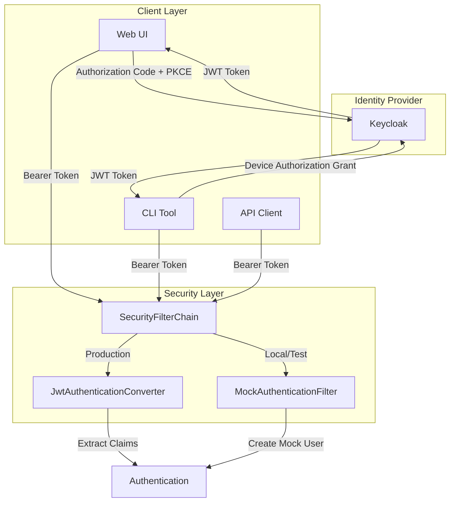

# Security API - Feature Specification

> **Version:** 1.0.0
> **Last Updated:** 2026-01-10
> **Status:** Phase 1 Complete

---

## Overview

OAuth2/OIDC security implementation for the Basecamp API server with support for both production (Keycloak) and local development (Mock) authentication modes.

### Goals

1. **Production-Ready Security**: OAuth2 Resource Server with JWT validation via Keycloak
2. **Developer Experience**: Mock authentication for local development without Keycloak dependency
3. **Extensibility**: Support for CLI (Device Authorization Grant) and UI (Authorization Code + PKCE) authentication
4. **Role-Based Access**: Granular authorization based on Keycloak realm/client roles

---

## Architecture

### Authentication Flow



### Security Modes

| Mode | Profile | Keycloak Required | Use Case |
|------|---------|-------------------|----------|
| **OAuth2/JWT** | `dev`, `prod` | Yes | Production, Staging |
| **Mock** | `local`, `test` | No | Local development, Testing |

---

## Configuration

### Application Properties

```yaml
# app.security configuration
app:
  security:
    mock-auth-enabled: false  # true for local/test profiles
    mock-user:
      id: "1"
      email: "dev@dataops.local"
      roles:
        - admin
        - editor
        - viewer

# Spring Security OAuth2 configuration
spring:
  security:
    oauth2:
      resourceserver:
        jwt:
          issuer-uri: http://localhost:8080/realms/playground
          jwk-set-uri: http://localhost:8080/realms/playground/protocol/openid-connect/certs
```

### Profile-Based Activation

| Profile | `mock-auth-enabled` | OAuth2 Auto-Config |
|---------|--------------------|--------------------|
| `local` | `true` | Excluded |
| `test` | `true` | Excluded |
| `dev` | `false` | Enabled |
| `prod` | `false` | Enabled |

---

## Keycloak Setup

### Realm Configuration

- **Realm Name:** `playground`
- **SSL Required:** None (development)
- **Events:** Enabled for audit

### Clients

| Client ID | Purpose | Grant Types |
|-----------|---------|-------------|
| `application` | Web UI (Browser-based) | Authorization Code, Direct Access |
| `cli-service` | CLI Tool | Device Authorization, Direct Access |

### Roles

| Role | Description | Permissions |
|------|-------------|-------------|
| `admin` | Full administrative access | All operations |
| `editor` | Write access | Create, update, delete resources |
| `viewer` | Read-only access | View resources only |

### Test Users

| Username | Email | Password | Roles |
|----------|-------|----------|-------|
| `admin` | admin@dataops.local | admin123 | admin, editor, viewer |
| `editor` | editor@dataops.local | editor123 | editor, viewer |
| `viewer` | viewer@dataops.local | viewer123 | viewer |
| `lambda` | 1ambda@github.com | changeme | admin, editor, viewer |

---

## Mock Authentication (Local Development)

### Header-Based Authentication

When `mock-auth-enabled=true`, the `MockAuthenticationFilter` creates authentication from request headers:

| Header | Description | Default |
|--------|-------------|---------|
| `X-Mock-User-Id` | User ID | Configured `mock-user.id` |
| `X-Mock-User-Email` | User email | Configured `mock-user.email` |
| `X-Mock-User-Roles` | Comma-separated roles | Configured `mock-user.roles` |

### Usage in Tests

```kotlin
// Using default mock user
mockMvc.get("/api/v1/pipelines")
    .andExpect(status().isOk)

// Custom mock user via headers
mockMvc.get("/api/v1/admin/settings") {
    header("X-Mock-User-Id", "999")
    header("X-Mock-User-Email", "admin@test.com")
    header("X-Mock-User-Roles", "admin,editor")
}
```

---

## Public Endpoints

The following endpoints do not require authentication:

| Endpoint | Purpose |
|----------|---------|
| `/api/health` | Health check (legacy) |
| `/api/v1/health` | Component health |
| `/api/v1/health/extended` | Extended diagnostics |
| `/api/info` | System information |
| `/actuator/**` | Spring Actuator endpoints |
| `/v3/api-docs/**` | OpenAPI documentation |
| `/swagger-ui/**` | Swagger UI |

---

## Role Extraction

### JWT Token Structure (Keycloak)

```json
{
  "sub": "user-uuid",
  "email": "user@example.com",
  "preferred_username": "username",
  "realm_access": {
    "roles": ["admin", "editor", "viewer"]
  },
  "resource_access": {
    "application": {
      "roles": ["app-specific-role"]
    }
  },
  "scope": "openid email profile"
}
```

### Authority Mapping

| Source | Format | Example |
|--------|--------|---------|
| Realm Roles | `ROLE_{role}` | `ROLE_admin` |
| Client Roles | `ROLE_{role}` | `ROLE_app-specific-role` |
| Scopes | `SCOPE_{scope}` | `SCOPE_openid` |

---

## SecurityContext Utility

### Available Methods

| Method | Return Type | Description |
|--------|-------------|-------------|
| `getCurrentUserId()` | `Long?` | User ID from `sub` claim |
| `getCurrentUserIdOrThrow()` | `Long` | User ID or throws exception |
| `getCurrentUserSubject()` | `String?` | Raw subject string |
| `getCurrentUsername()` | `String` | Email or username |
| `getCurrentRoles()` | `List<String>` | Roles without `ROLE_` prefix |
| `getCurrentAuthorities()` | `List<String>` | All authorities (roles + scopes) |
| `hasRole(role)` | `Boolean` | Check specific role |
| `getCurrentJwt()` | `Jwt?` | Raw JWT token (if available) |
| `currentSession()` | `SessionResponse` | Full session info |

### Usage Example

```kotlin
@RestController
class MyController {
    @GetMapping("/protected")
    fun protectedEndpoint(): String {
        val userId = SecurityContext.getCurrentUserIdOrThrow()
        val isAdmin = SecurityContext.hasRole(UserRole.admin)
        val email = SecurityContext.getCurrentUsername()

        return "Hello, $email (ID: $userId, Admin: $isAdmin)"
    }
}
```

---

## Implementation Phases

### Phase 1: Core Authentication (Complete)

- [x] OAuth2 Resource Server configuration
- [x] JWT validation with Keycloak
- [x] Mock authentication for local/test
- [x] SecurityContext utility
- [x] Role extraction from JWT claims
- [x] Public endpoint configuration
- [x] Profile-based security modes

### Phase 2: CLI Authentication (Planned)

- [ ] Device Authorization Grant flow implementation
- [ ] CLI token storage and refresh
- [ ] CLI `dli auth login/logout` commands

### Phase 3: UI Authentication (Planned)

- [ ] Authorization Code + PKCE flow
- [ ] React auth provider integration
- [ ] Session management with refresh tokens

### Phase 4: Advanced Features (Future)

- [ ] API key authentication for service-to-service
- [ ] Rate limiting per user/role
- [ ] Audit logging integration
- [ ] Multi-tenant support

---

## Related Documentation

- [SECURITY_RELEASE.md](./SECURITY_RELEASE.md) - Implementation details
- [TEAM_FEATURE.md](./TEAM_FEATURE.md) - Team-based authorization
- [RESOURCE_FEATURE.md](./RESOURCE_FEATURE.md) - Resource sharing permissions

---

*Last Updated: 2026-01-10 | Next Review: As needed*
